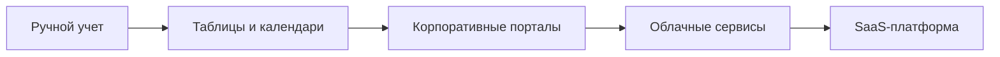
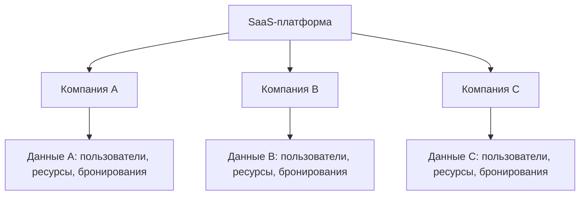
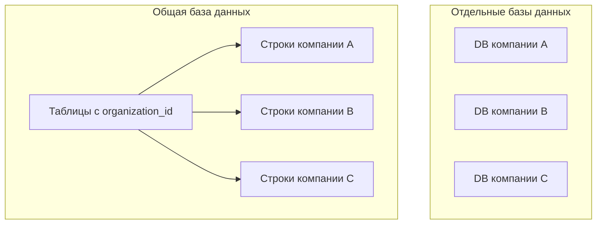
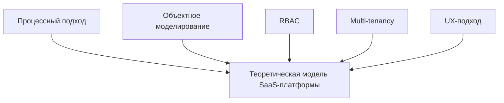
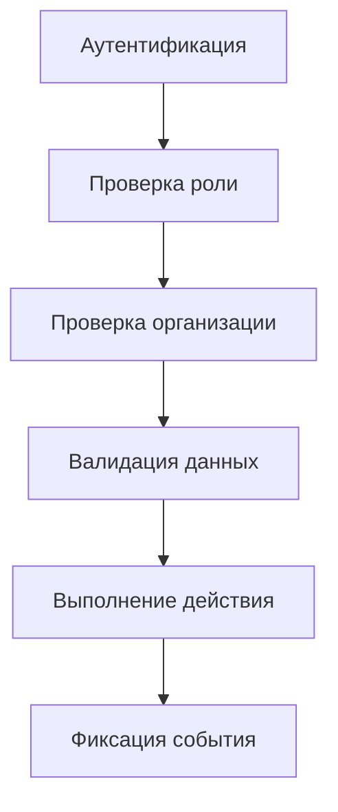

# Глава 1. Теоретико-методологические основы разработки SaaS-платформы для управления и бронирования внутренних ресурсов компаний

## 1.1. Эволюция подходов к управлению внутренними ресурсами компаний

Управление внутренними ресурсами компании является важной частью организационной деятельности, поскольку от доступности и рационального использования ресурсов зависят скорость выполнения рабочих процессов, комфорт сотрудников и эффективность эксплуатации корпоративной инфраструктуры. Под внутренними ресурсами в рамках данной работы понимаются объекты, которые используются сотрудниками внутри организации: переговорные комнаты, рабочие места, оборудование, служебный транспорт, проекторы, парковочные места, лабораторные установки и иные материальные объекты, требующие предварительного резервирования или учета.

На ранних этапах развития организаций управление такими ресурсами осуществлялось преимущественно вручную. Сотрудники договаривались между собой устно, оставляли записи в бумажных журналах, обращались к офис-менеджеру или фиксировали бронирования в произвольной форме. Такой подход был приемлем для небольших коллективов, где количество ресурсов ограничено, а сотрудники хорошо осведомлены о текущей занятости объектов. Однако при росте компании ручное управление начинает создавать значительное количество организационных проблем: сведения о доступности ресурсов быстро устаревают, бронирования пересекаются, решения зависят от конкретного ответственного лица, а история использования практически не анализируется.

Следующим этапом стало использование электронных таблиц и общих календарей. Электронные таблицы позволили частично централизовать информацию: сотрудники получили возможность видеть общее расписание, а администраторы — редактировать записи и поддерживать актуальность данных. Общие календари добавили привычный визуальный формат планирования и интеграцию с рабочими встречами. Тем не менее эти инструменты изначально не создавались как полноценные системы управления ресурсами. Они плохо поддерживают сложные правила доступа, не всегда предотвращают конфликтные бронирования, не дают развитой аналитики и не обеспечивают строгую изоляцию данных между подразделениями или организациями.

Дальнейшее развитие корпоративных информационных систем привело к появлению специализированных модулей в составе ERP, HRM, Service Desk и корпоративных порталов. Такие решения уже позволяют формализовать процесс заявки, добавить согласование, хранить историю и использовать роли пользователей. Однако их внедрение часто требует существенных затрат, настройки инфраструктуры и участия IT-специалистов. Для малых и средних компаний подобные системы могут оказаться избыточными, а для быстрорастущих организаций — недостаточно гибкими.

Современный этап развития связан с распространением облачных сервисов и SaaS-модели. Согласно определению NIST, облачные вычисления предполагают удобный сетевой доступ по требованию к общему пулу конфигурируемых вычислительных ресурсов, которые могут быстро предоставляться и освобождаться с минимальными управленческими усилиями [1]. В стандарте ISO/IEC 17788 облачные сервисы также рассматриваются как модель предоставления ИТ-возможностей через сеть с использованием масштабируемых и измеряемых ресурсов [2]. В этом контексте SaaS является прикладной формой облачной модели: пользователь получает доступ к программной функциональности через браузер, а поставщик сервиса отвечает за обновления, хранение данных, доступность и развитие продукта.

Для задачи бронирования внутренних ресурсов SaaS-подход особенно актуален, поскольку он позволяет быстро подключать новые компании, масштабировать количество пользователей и ресурсов, централизованно обновлять функциональность и обеспечивать доступ из разных локаций. Вместе с тем этот подход нельзя рассматривать как универсально лучший: он переносит часть рисков в область информационной безопасности, доступности сервиса, изоляции данных клиентов и зависимости от поставщика облачной инфраструктуры. Поэтому в рамках ВКР SaaS-модель рассматривается не как безусловно оптимальная, а как рациональная для проектируемой системы при заданных ограничениях: необходимости веб-доступа, поддержки нескольких организаций, умеренной сложности внедрения и возможности поэтапного развития.

Эволюция подходов к управлению внутренними ресурсами компаний представлена в [таблице 1.1](#table-1-1).

Таблица 1.1 — Этапы развития управления внутренними ресурсами компаний.

| Этап развития | Типичный инструмент | Преимущества | Ограничения |
|---|---|---|---|
| Ручной учет | Устные договоренности, бумажный журнал | Простота, отсутствие затрат на внедрение | Нет прозрачности, высокая вероятность ошибок, нет аналитики |
| Электронные таблицы | Excel, Google Sheets | Единое место фиксации данных, доступность | Слабая защита от ошибок, нет автоматической проверки конфликтов |
| Общие календари | Outlook Calendar, Google Calendar | Удобное отображение времени, привычный интерфейс | Ограниченная работа с типами ресурсов, ролями и аналитикой |
| Корпоративные системы | ERP, HRM, Service Desk, порталы | Формализация процесса, роли, история заявок | Высокая стоимость внедрения, сложная настройка |
| SaaS-платформы | Веб-сервис бронирования ресурсов | Быстрый запуск, масштабируемость, централизованные обновления | Требования к безопасности, изоляции данных и доступности |

Схематично этот переход показан на [рисунке 1.1](#fig-1-1).

Рисунок 1.1 — Эволюция подходов к управлению внутренними ресурсами.

Таким образом, эволюция подходов показывает постепенный переход от неформального учета к формализованным цифровым платформам. Главная причина такого перехода состоит в необходимости снизить зависимость от человеческого фактора, обеспечить прозрачность использования ресурсов и создать основу для анализа загрузки корпоративной инфраструктуры.

## 1.2. Сравнительный анализ концепций программных решений для бронирования ресурсов

Для решения задачи управления и бронирования внутренних ресурсов могут использоваться различные концепции программных решений. Их можно условно разделить на пять групп: локальное программное обеспечение, универсальные календарные инструменты, модули корпоративных систем, специализированные booking-системы и SaaS-платформы.

Локальное программное обеспечение предполагает установку приложения на компьютеры пользователей или сервер компании. Преимущество данного подхода заключается в контроле над инфраструктурой и данными. Организация самостоятельно определяет правила хранения, резервного копирования и доступа. Однако локальные решения требуют затрат на администрирование, обновление и поддержку. Кроме того, доступность системы за пределами корпоративной сети может быть ограничена, что снижает применимость такого подхода для распределенных команд.

Универсальные календарные инструменты удобны тем, что уже используются сотрудниками для планирования встреч. Например, переговорная комната может быть заведена как отдельный календарь или ресурс, который добавляется в событие. Такой подход снижает порог входа, но не решает всех задач предметной области. Календарные инструменты не всегда позволяют учитывать вместимость, оборудование, сложные правила согласования, аналитику загрузки и различия между типами ресурсов. Кроме того, универсальный календарь ориентирован прежде всего на событие во времени, а не на управление жизненным циклом корпоративного ресурса.

Модули корпоративных систем могут быть эффективны в организациях, где уже внедрены ERP, HRM или Service Desk. Они позволяют встроить бронирование ресурсов в существующие бизнес-процессы. Однако такие системы часто ориентированы на широкий набор задач и не всегда дают удобный специализированный интерфейс для повседневного бронирования. Их внедрение может быть дорогостоящим и длительным, а изменение процессов обычно связано с регламентами и доработками существующей корпоративной инфраструктуры.

Специализированные booking-системы обычно предоставляют более богатый функционал для управления ресурсами: каталог объектов, календарь занятости, правила бронирования, уведомления и отчеты. При этом часть таких решений ориентирована на конкретный тип ресурсов, например только на переговорные комнаты или рабочие места. Это ограничивает гибкость применения в компаниях, где нужно управлять разными категориями объектов.

SaaS-платформа объединяет преимущества веб-доступа, масштабируемости и централизованного обслуживания. В архитектурных материалах AWS и Microsoft для SaaS-решений подчеркивается, что принципиальными характеристиками таких систем являются единая кодовая база, обслуживание нескольких клиентов, автоматизация эксплуатации и контроль изоляции tenant-данных [15], [17]. Для предметной области бронирования это означает возможность одной платформой обслуживать несколько организаций, сохраняя раздельность их пользователей, ресурсов и бронирований.

Сравнительная характеристика концепций программных решений приведена в [таблице 1.2](#table-1-2).

Таблица 1.2 — Сравнение концепций программных решений для бронирования ресурсов по критериям задач данной работы.

| Критерий | Локальное ПО | Таблицы и календари | Корпоративные модули | Специализированные системы | SaaS-платформа |
|---|---:|---:|---:|---:|---:|
| Быстрота внедрения | Средняя | Высокая | Низкая | Средняя | Высокая |
| Масштабируемость | Средняя | Низкая | Средняя | Средняя | Высокая |
| Проверка конфликтов | Возможна | Ограничена | Возможна | Обычно есть | Обязательна |
| Ролевая модель | Возможна | Ограничена | Есть | Есть | Есть |
| Аналитика | Зависит от реализации | Слабая | Возможна | Обычно есть | Может развиваться поэтапно |
| Интеграционная сложность | Средняя | Низкая | Высокая | Средняя | Средняя |
| Стоимость поддержки | Высокая | Низкая | Высокая | Средняя | Средняя |
| Изоляция компаний | Неактуальна | Неактуальна | Зависит от системы | Зависит от системы | Ключевое требование |

Сравнение показывает, что SaaS-подход в рамках целей данной работы представляется наиболее рациональным. Он позволяет создать универсальную платформу, пригодную для разных организаций, не ограничиваясь одним типом ресурсов и не требуя сложного локального внедрения. При этом дальнейшее проектирование должно учитывать не только преимущества SaaS, но и его ограничения: риски нарушения изоляции данных, необходимость стабильной сетевой доступности, требования к аутентификации и контролю ролей.

## 1.3. Критическая оценка методологий и архитектурных подходов

Разработка SaaS-платформы для управления ресурсами требует не только выбора технологий, но и опоры на методологические подходы, позволяющие правильно описать предметную область, выделить сущности, определить процессы и спроектировать механизмы доступа. В программной инженерии такие решения обычно связываются с анализом требований, моделированием предметной области, архитектурным проектированием и оценкой качества программной системы [26], [27].

Процессный подход рассматривает бронирование как последовательность действий: выбор ресурса, проверка доступности, создание заявки, подтверждение, использование и завершение. Его преимущество состоит в том, что он позволяет увидеть процесс глазами пользователя и выявить проблемные точки. Однако процессный подход сам по себе недостаточен для проектирования структуры данных и архитектуры приложения: он показывает последовательность операций, но не отвечает на вопрос, какие сущности, связи и ограничения должны существовать в системе.

Объектно-ориентированное моделирование позволяет представить предметную область через сущности: организация, пользователь, ресурс, тип ресурса, бронирование, роль. Такой подход согласуется с практиками UML-моделирования и доменного анализа, где предметная область описывается через объекты, их свойства, связи и поведение [8], [28], [29]. Его ограничение заключается в том, что он может недостаточно учитывать динамику бизнес-процессов, если используется отдельно от сценарного анализа.

Ролевая модель доступа RBAC используется для разграничения прав пользователей. В контексте платформы можно выделить обычного сотрудника, администратора организации, руководителя и системного администратора. RBAC позволяет формализовать, кто может создавать ресурсы, кто может бронировать, кто может отменять чужие заявки и кто имеет доступ к аналитике. Ограничением RBAC является то, что при сложных организационных правилах может потребоваться более гибкая модель, учитывающая подразделения, типы ресурсов, условия согласования и контекст выполнения действия. Поэтому в проектируемой системе RBAC рассматривается как базовый, но не исчерпывающий механизм авторизации.

Архитектурный подход multi-tenancy является одним из ключевых для SaaS-систем. Он предполагает, что одна платформа обслуживает несколько организаций-клиентов, при этом данные каждой организации изолированы. Существуют разные варианты реализации многоклиентской архитектуры: общая база данных с идентификатором организации, отдельные схемы в одной базе или отдельные базы данных для каждого клиента [15], [16]. В рамках ВКР наиболее рациональным вариантом является общая база данных с логической изоляцией по `organization_id`, поскольку такой подход проще реализовать и достаточно нагляден для учебного проекта. Однако его недостаток заключается в высокой зависимости безопасности от корректности фильтрации данных в серверной логике и запросах к базе данных.

Логическая модель multi-tenancy для SaaS-платформы показана на [рисунке 1.2](#fig-1-2).

Рисунок 1.2 — Логическая модель multi-tenancy для SaaS-платформы.

Сводное описание методологических и архитектурных подходов приведено в [таблице 1.3](#table-1-3).

Таблица 1.3 — Методологические и архитектурные подходы для проектирования SaaS-платформы.

| Методология / подход | Применимость в работе | Ограничения | Роль в исследовании |
|---|---|---|---|
| Процессный подход | Описание жизненного цикла бронирования | Не описывает структуру данных | Помогает выявить сценарии и проблемы |
| Объектное моделирование | Выделение сущностей системы | Требует дополнения сценариями | Основа ER-модели и модулей приложения |
| RBAC | Разграничение прав доступа | Может быть недостаточно гибким для сложных правил | Основа безопасности на уровне ролей |
| Multi-tenancy | Поддержка нескольких организаций | Требует строгой изоляции данных | Основа SaaS-архитектуры |
| UX-подход | Проектирование понятного интерфейса | Не заменяет бизнес-логику | Снижает сложность пользовательских действий |

Критическая оценка показывает, что ни один из подходов не является достаточным сам по себе. Для разработки платформы необходимо комбинировать процессное описание, объектное моделирование, ролевую модель доступа, multi-tenant архитектуру и принципы удобства пользовательского взаимодействия. Такое сочетание позволяет одновременно учитывать действия пользователей, структуру данных, требования безопасности и особенности SaaS-модели.

## 1.4. Формирование теоретической базы собственного исследования

На основе рассмотренных подходов можно сформировать теоретическую базу для разработки собственной SaaS-платформы. Во-первых, управление внутренними ресурсами должно рассматриваться как формализуемый бизнес-процесс, а не как набор разрозненных заявок. Это означает необходимость описания жизненного цикла бронирования, участников процесса и правил перехода между состояниями.

Во-вторых, ресурсы компании должны быть представлены как структурированные объекты с набором атрибутов: тип, название, расположение, вместимость, статус, принадлежность к организации. Такой подход позволяет не ограничиваться только переговорными комнатами и поддерживать разные категории корпоративных ресурсов. С точки зрения моделирования данных это соответствует подходу, при котором предметная область описывается через устойчивые сущности и связи между ними [7], [8].

В-третьих, для SaaS-платформы принципиально важна изоляция данных организаций. Пользователь одной компании не должен видеть ресурсы, пользователей и бронирования другой компании. Следовательно, принадлежность данных к организации должна учитываться во всех ключевых сущностях и запросах. В проектируемой системе для этого используется tenant-контекст, выраженный через `organization_id` в таблицах пользователей, ресурсов и бронирований.

В-четвертых, центральным элементом бизнес-логики является проверка пересечений временных интервалов. Именно она обеспечивает надежность бронирования и предотвращает конфликтное использование одного ресурса несколькими сотрудниками. Если такая проверка реализована некорректно, система не решает основную проблему предметной области. Для собственного решения это означает необходимость проверять новое бронирование по правилу пересечения интервалов: начало нового интервала должно быть меньше окончания существующего, а окончание нового интервала — больше начала существующего.

В-пятых, платформа должна учитывать роль пользователя. Обычный сотрудник, администратор организации, руководитель и системный администратор выполняют разные действия и должны иметь разные права. При этом роль пользователя должна проверяться совместно с организационной принадлежностью данных. Иначе пользователь с формально подходящей ролью может получить доступ к объектам другой организации, что противоречит принципу tenant isolation.

Таким образом, теоретическая база собственного исследования включает следующие положения:

- управление внутренними ресурсами является бизнес-процессом, требующим формализации;
- SaaS-модель является рациональной для создания масштабируемой платформы бронирования при условии учета рисков безопасности и доступности;
- multi-tenancy обеспечивает использование одной платформы несколькими организациями, но требует строгого tenant-контекста;
- RBAC позволяет разграничить действия пользователей, однако должен дополняться проверкой принадлежности данных к организации;
- объектная модель предметной области необходима для проектирования базы данных и модулей приложения;
- проверка пересечений временных интервалов является ключевой бизнес-логикой системы.

Выводы первой главы служат основой для дальнейшего анализа предметной области и проектирования системы во второй главе. Если первая глава отвечает на вопрос, какие теоретические подходы применимы к проблеме, то вторая глава должна показать, как эти подходы преобразуются в требования, архитектуру и проектные решения.

## 1.5. Варианты реализации multi-tenancy в SaaS-системах

Поскольку тема работы связана с SaaS-платформой, отдельного рассмотрения требует вопрос организации многоклиентской архитектуры. Multi-tenancy предполагает, что одна программная платформа обслуживает несколько независимых клиентов, называемых tenant. В рамках данной работы tenant соответствует организации, использующей систему для управления собственными ресурсами. В архитектурных руководствах по SaaS подчеркивается, что tenant isolation является не только вопросом структуры базы данных, но и сквозным принципом проектирования приложения: он должен учитываться в API, бизнес-логике, механизмах авторизации, тестировании и мониторинге [15], [16], [17].

Существует несколько распространенных вариантов реализации multi-tenancy. Первый вариант — отдельная база данных для каждого клиента. Он обеспечивает высокий уровень физической изоляции данных, но усложняет администрирование, обновления и масштабирование. Второй вариант — отдельная схема базы данных для каждого клиента. Он является компромиссом между изоляцией и управляемостью, но также требует дополнительной логики миграций и сопровождения. Третий вариант — общая база данных и общие таблицы с обязательным полем `organization_id` или `tenant_id`. Этот подход проще в реализации и хорошо подходит для учебного проекта или MVP, однако требует строгого контроля доступа на уровне приложения и запросов к данным.

Сравнение вариантов организации multi-tenant архитектуры данных представлено в [таблице 1.4](#table-1-4).

Таблица 1.4 — Варианты организации многопользовательской (multi-tenant) архитектуры данных применительно к ВКР.

| Подход | Принцип | Преимущества | Недостатки | Применимость в ВКР |
|---|---|---|---|---|
| Отдельная база на клиента | Каждый tenant хранится в своей БД | Сильная изоляция, проще выполнять перенос клиента | Сложное сопровождение, дорогая инфраструктура | Избыточно для учебного прототипа |
| Отдельная схема | Одна БД, разные схемы | Баланс изоляции и администрирования | Сложные миграции, больше DevOps-задач | Возможно, но усложняет реализацию |
| Общие таблицы | Все tenant в одних таблицах с `organization_id` | Простота, единая модель, быстрый старт | Нужен строгий контроль фильтрации и тестирование изоляции | Рационально для данной работы |

Сравнение физической и логической изоляции данных показано на [рисунке 1.3](#fig-1-3).

Рисунок 1.3 — Сравнение физической и логической изоляции данных в SaaS-архитектуре.

В рамках данной работы выбран вариант с общей базой данных и логической изоляцией по идентификатору организации. Такой подход позволяет наглядно показать принцип SaaS-платформы, не перегружая проект инфраструктурной сложностью. При этом он сохраняет важнейшее требование: любой запрос к ресурсам, пользователям и бронированиям должен выполняться только в контексте организации текущего пользователя.

Риск выбранного подхода состоит в том, что ошибка в одном запросе может привести к нарушению изоляции данных. Поэтому в собственной системе данный риск должен снижаться несколькими мерами: хранением `organization_id` в ключевых таблицах, получением tenant-контекста из данных аутентифицированного пользователя, проверкой роли совместно с организацией, фильтрацией списков по `organization_id` и тестированием сценариев доступа между разными организациями. Таким образом, выбор общей базы данных является не упрощением требований безопасности, а компромиссом между реализуемостью ВКР и необходимостью продемонстрировать ключевые свойства SaaS-архитектуры.

## 1.6. Критерии оценки теоретических подходов для собственного решения

Для формирования собственной модели платформы недостаточно просто перечислить известные подходы. Необходимо определить критерии, по которым оценивается их применимость. В контексте данной работы такими критериями являются соответствие предметной области, реализуемость в рамках ВКР, масштабируемость, безопасность, удобство пользователей и возможность дальнейшего развития. Критерии качества программной системы в общем виде соотносятся с ISO/IEC 25010, где среди характеристик качества выделяются функциональная пригодность, производительность, совместимость, удобство использования, надежность, безопасность, сопровождаемость и переносимость [4].

Процессный подход хорошо подходит для описания жизненного цикла бронирования и выявления проблем ручного учета, но не дает полной модели данных. Объектное моделирование, напротив, позволяет выделить сущности и связи, однако без процессного анализа может привести к формальному описанию таблиц без понимания пользовательских сценариев. Ролевая модель доступа решает задачу разграничения прав, но должна дополняться tenant-контекстом, иначе пользователь с правильной ролью может случайно получить доступ к данным чужой организации. Multi-tenancy задает архитектурную основу SaaS-платформы, но требует дисциплины при проектировании API и базы данных.

Сводная оценка применимости теоретических подходов приведена в [таблице 1.5](#table-1-5).

Таблица 1.5 — Сводная оценка применимости теоретических подходов для собственного решения по критериям задач ВКР.

| Критерий | Процессный подход | Объектное моделирование | RBAC | Multi-tenancy | UX-подход |
|---|---:|---:|---:|---:|---:|
| Описание действий пользователя | Высокое | Среднее | Низкое | Низкое | Высокое |
| Проектирование структуры данных | Низкое | Высокое | Среднее | Высокое | Низкое |
| Безопасность и доступ | Среднее | Среднее | Высокое | Высокое | Низкое |
| Масштабирование под организации | Низкое | Среднее | Среднее | Высокое | Среднее |
| Удобство использования | Среднее | Низкое | Среднее | Низкое | Высокое |
| Применимость в ВКР | Высокое | Высокое | Высокое | Высокое | Среднее |

Итоговая теоретическая модель собственного исследования строится на сочетании этих подходов. Процессный анализ используется для описания сценариев бронирования, объектное моделирование — для проектирования сущностей и базы данных, RBAC — для разграничения ролей, multi-tenancy — для SaaS-архитектуры, а UX-подход — для упрощения взаимодействия пользователя с системой. Работы Нильсена и Нормана показывают, что удобство интерфейса не является второстепенным свойством: оно влияет на вероятность ошибок, скорость выполнения задач и принятие системы пользователями [24], [25]. Поэтому UX-подход в данной работе рассматривается как вспомогательный, но практически значимый компонент проектирования.

Состав теоретической модели собственного исследования представлен на [рисунке 1.4](#fig-1-4).

Рисунок 1.4 — Состав теоретической модели собственного исследования.

## 1.7. Теоретические аспекты безопасности SaaS-платформ

При разработке SaaS-платформы для управления внутренними ресурсами безопасность нельзя рассматривать как второстепенное требование. Несмотря на то что система не обрабатывает финансовые транзакции или медицинские данные, она хранит сведения о сотрудниках, расписаниях, внутренних объектах компании, структуре подразделений и характере использования корпоративной инфраструктуры. В совокупности эти данные могут представлять управленческую и организационную ценность. Поэтому при проектировании необходимо учитывать как общие требования информационной безопасности, отраженные в ISO/IEC 27001, так и практические рекомендации по безопасности веб-приложений OWASP [3], [13], [14].

Первым аспектом безопасности является аутентификация, то есть проверка личности пользователя. В базовой версии платформы она может быть реализована через электронную почту и пароль. При этом для хранения паролей должны использоваться стойкие механизмы хэширования с солью, например bcrypt или Argon2, поскольку простое хэширование без специальных механизмов замедления подбора не обеспечивает достаточной защиты при компрометации базы данных. После успешной аутентификации система может использовать session-based auth или токены, например JWT, однако выбор JWT требует контроля срока действия токена, защиты секретного ключа и аккуратной обработки сценариев выхода пользователя [23].

Второй аспект — авторизация, то есть определение доступных пользователю действий. Авторизация в данной работе строится на ролевой модели. Пользователь может быть сотрудником, администратором организации, руководителем или системным администратором. Однако роли недостаточно проверять изолированно. В SaaS-системе необходимо дополнительно учитывать принадлежность данных к организации. Например, администратор организации имеет расширенные права, но только в рамках своей компании.

Третий аспект связан с изоляцией tenant-данных. Если одна платформа обслуживает несколько компаний, ошибка в фильтрации данных может привести к тому, что пользователь одной организации увидит ресурсы или бронирования другой. Поэтому tenant isolation является не только архитектурным, но и безопасностным требованием. Для выбранной архитектуры с общей базой данных это означает, что каждый запрос к данным должен выполняться с учетом `organization_id`, а операции изменения должны проверять не только существование объекта, но и его принадлежность организации текущего пользователя.

Четвертый аспект — аудит действий. Для систем управления ресурсами важно понимать, кто создал, изменил или отменил бронирование. Это помогает разбирать спорные ситуации и повышает ответственность пользователей. Даже если полноценный аудит не реализуется в первой версии, сама модель данных должна предусматривать хранение автора действия, дат создания и обновления, статусов записей и причин отмены бронирования.

Пятый аспект — валидация данных и защита бизнес-правил. Для рассматриваемой платформы это включает проверку корректности временного интервала, запрет бронирования недоступного ресурса, запрет операций с чужими данными и обработку конфликтов. С точки зрения OWASP такие проверки важны не только для удобства пользователя, но и для предотвращения нарушений контроля доступа и некорректных операций на стороне сервера [13], [14].

Теоретические аспекты информационной безопасности систематизированы в [таблице 1.6](#table-1-6).

Таблица 1.6 — Теоретические аспекты информационной безопасности разрабатываемой SaaS-платформы.

| Аспект безопасности | Значение для платформы | Пример реализации |
|---|---|---|
| Аутентификация | Подтверждение личности пользователя | Вход по email и паролю, session/JWT |
| Хранение паролей | Снижение риска утечки учетных данных | bcrypt или Argon2 с солью |
| Авторизация | Ограничение действий пользователя | Проверка роли перед операцией |
| Tenant isolation | Защита данных организаций | Фильтрация и изменение данных только по `organization_id` |
| Аудит | Разбор спорных ситуаций | Хранение автора, даты и статуса действия |
| Валидация данных | Защита от некорректных операций | Проверка времени, статусов и конфликтов |

Уровни проверки безопасности при выполнении пользовательского действия показаны на [рисунке 1.5](#fig-1-5).

Рисунок 1.5 — Уровни проверки безопасности при выполнении пользовательского действия.

Таким образом, безопасность SaaS-платформы должна рассматриваться комплексно. Для темы данной работы особенно важны не только парольная защита и роли, но и корректная изоляция организаций, поскольку именно она отличает SaaS-подход от обычного однопользовательского или одноклиентского приложения. В дальнейшем эти положения должны быть преобразованы в конкретные требования к архитектуре, базе данных, API и тестированию.

## Выводы по главе 1

В первой главе была рассмотрена эволюция подходов к управлению внутренними ресурсами компаний: от ручного учета и электронных таблиц до специализированных систем и SaaS-платформ. Было установлено, что ручные и универсальные инструменты не обеспечивают достаточной надежности, прозрачности и масштабируемости при росте количества ресурсов и пользователей.

Сравнительный анализ концепций программных решений показал, что SaaS-подход в рамках ограничений данной ВКР является рациональной основой для разработки платформы для разных организаций. Он обеспечивает веб-доступ, централизованное обновление, гибкое масштабирование и возможность логической изоляции данных клиентов. Одновременно были выделены ограничения данного подхода: зависимость от сетевой доступности, требования к защите данных, необходимость контроля tenant isolation и аккуратного проектирования авторизации.

Критическая оценка методологий показала необходимость сочетания нескольких подходов: процессного анализа, объектного моделирования, RBAC, multi-tenancy и UX-проектирования. На их основе была сформирована теоретическая база собственного исследования, которая используется далее при анализе предметной области и проектировании SaaS-платформы.

Для собственного решения обоснован выбор общей базы данных с логической изоляцией по `organization_id`, ролевой модели доступа и алгоритма проверки пересечений временных интервалов. Эти решения не являются единственно возможными, однако они соответствуют целям ВКР, позволяют продемонстрировать ключевые свойства SaaS-системы и создают основу для практической реализации, описываемой в последующих главах.
