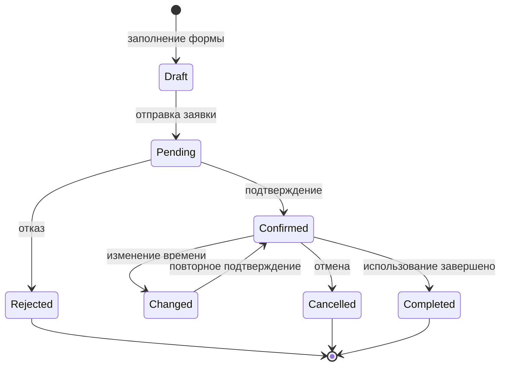
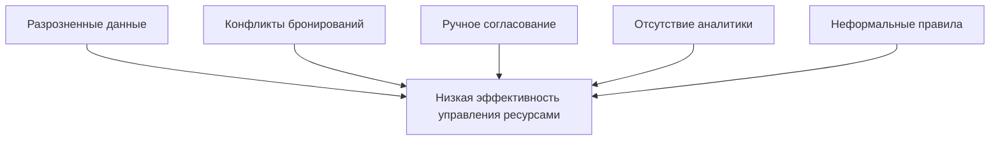
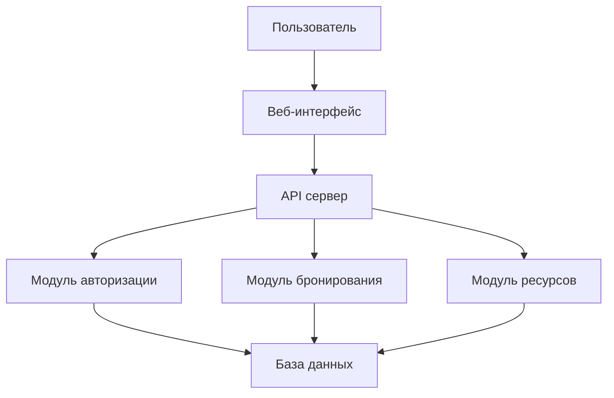
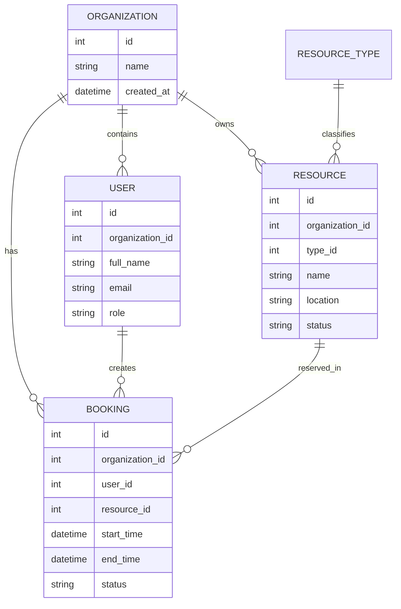
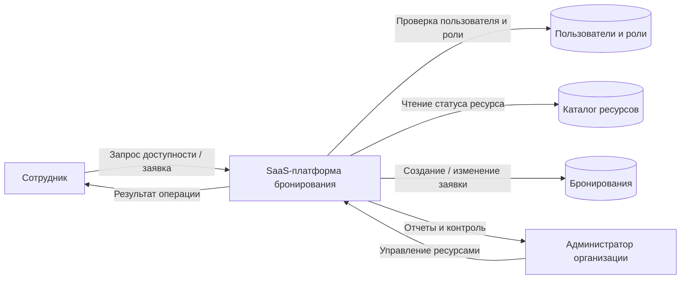
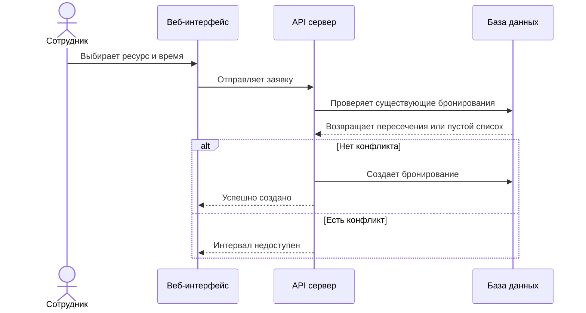
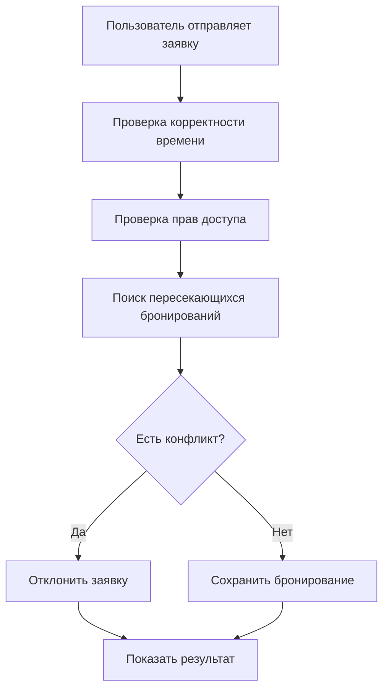
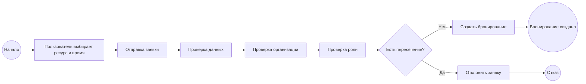
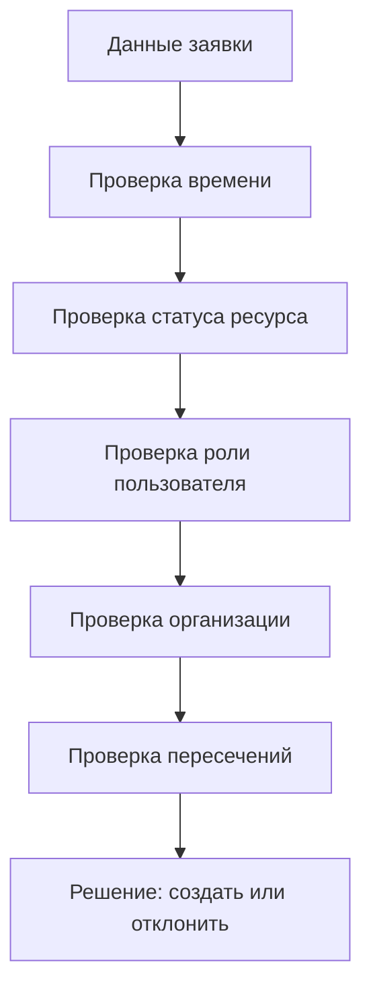
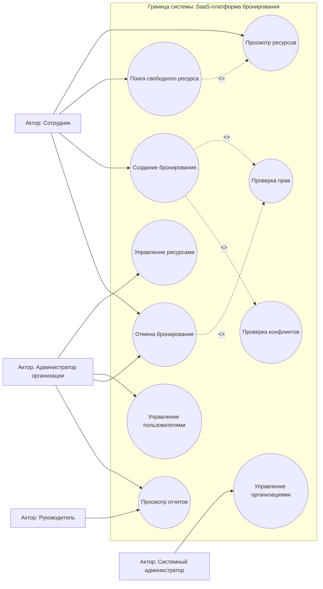

# Глава 2. Анализ предметной области и проектирование SaaS-платформы

## 2.1. Характеристика предметной области

Предметной областью данной выпускной квалификационной работы является управление и бронирование внутренних ресурсов компаний. Под внутренними ресурсами понимаются объекты корпоративной инфраструктуры, которые используются сотрудниками для выполнения рабочих задач и требуют учета доступности. К таким объектам относятся переговорные комнаты, рабочие места, конференц-залы, оборудование, служебный транспорт, парковочные места, проекторы, ноутбуки и другие ресурсы, которые могут быть ограничены по времени, количеству или правам доступа.

С точки зрения информационных систем данная предметная область относится к классу задач управления ограниченными ресурсами и расписаниями. Для ее формализации применяются процессный подход, объектное моделирование, ролевая модель доступа и принципы многоклиентской SaaS-архитектуры. Облачная модель оказания программных услуг соответствует определению NIST, согласно которому потребитель получает доступ к приложению через сеть, а инфраструктурные аспекты обслуживания скрыты от пользователя [1]. Для разрабатываемой платформы это означает необходимость централизованного веб-доступа, единой кодовой базы и строгого разделения данных организаций.

Особенность данной предметной области заключается в том, что один и тот же ресурс не может одновременно использоваться несколькими сотрудниками, если его физические или организационные характеристики этого не допускают. Например, одна переговорная комната не может быть занята двумя независимыми встречами в один и тот же промежуток времени. Аналогично служебный автомобиль или проектор может быть передан только одному пользователю на конкретный период.

В процессе управления ресурсами участвуют несколько групп пользователей. Их права целесообразно описывать через модель RBAC, при которой доступ определяется не индивидуальными исключениями, а назначенной пользователю ролью. Такой подход снижает сложность администрирования и делает правила доступа проверяемыми. В рамках платформы обычный сотрудник заинтересован в быстром поиске свободного ресурса и создании бронирования без лишних согласований. Администратор ресурса отвечает за актуальность каталога объектов, контроль расписания и разрешение спорных ситуаций. Руководитель заинтересован в получении аналитики по загрузке ресурсов и эффективности использования корпоративной инфраструктуры. Системный администратор обеспечивает техническую настройку платформы и управление организациями.


Участники процесса управления и бронирования внутренних ресурсов представлены в [таблице 2.1](#table-2-1).

<a id="table-2-1"></a>
Таблица 2.1 — Участники процесса управления и бронирования внутренних ресурсов компании.

| Участник | Цель | Типовые действия | Ограничения |
|---|---|---|---|
| Сотрудник | Забронировать ресурс для рабочей задачи | Поиск, просмотр расписания, создание и отмена заявки | Может управлять только своими бронированиями |
| Администратор ресурсов | Поддерживать актуальность ресурсов | Создание ресурсов, изменение статусов, контроль заявок | Действует в рамках своей организации |
| Руководитель | Анализировать использование ресурсов | Просмотр отчетов, оценка загрузки | Не обязательно управляет ресурсами напрямую |
| Системный администратор | Поддерживать работу платформы | Управление организациями, технические настройки | Не должен вмешиваться в бизнес-процессы без необходимости |

Ресурсы могут различаться по атрибутам и правилам использования. Для переговорной комнаты важны вместимость, расположение, наличие оборудования и доступность по времени. Для служебного транспорта важны категория, водитель, пробег и необходимость согласования. Для оборудования могут быть важны инвентарный номер, техническое состояние и ответственность за возврат.


Типы внутренних ресурсов и их ключевые атрибуты приведены в [таблице 2.2](#table-2-2).

<a id="table-2-2"></a>
Таблица 2.2 — Типы внутренних ресурсов, их ключевые атрибуты и типовые ограничения.

| Тип ресурса | Ключевые атрибуты | Типовые ограничения |
|---|---|---|
| Переговорная комната | Вместимость, этаж, оборудование | Нельзя бронировать в нерабочее время, возможны буферы между встречами |
| Рабочее место | Зона, номер стола, наличие монитора | Может быть доступно только определенным подразделениям |
| Оборудование | Инвентарный номер, состояние, ответственный | Может требовать подтверждения администратора |
| Служебный транспорт | Модель, номер, водитель, статус | Требует согласования и учета длительности использования |
| Парковочное место | Локация, номер, категория | Может быть закреплено за ролью или подразделением |

Жизненный цикл бронирования включает несколько состояний. Пользователь создает заявку, система проверяет доступность ресурса, после чего бронирование может быть подтверждено автоматически или отправлено на согласование. В дальнейшем бронирование может быть изменено, отменено, завершено или отклонено.


Диаграмма состояний жизненного цикла бронирования представлена на [рисунке 2.1](#fig-2-1).

<a id="fig-2-1"></a>
Рисунок 2.1 — Диаграмма состояний жизненного цикла бронирования.



Границы разрабатываемой системы включают учет организаций, пользователей, ролей, ресурсов и бронирований. В рамках базовой версии не предполагается реализация сложных финансовых расчетов, биллинга, полноценной системы технического обслуживания оборудования или интеграции с физическими замками помещений. Эти функции могут рассматриваться как направления дальнейшего развития. Такое ограничение области исследования позволяет сосредоточиться на ключевых для SaaS-платформы аспектах: tenant isolation, ролях, проверке временных конфликтов и проектировании надежной модели данных.

## 2.2. Анализ текущих проблем и причинно-следственных связей

Во многих организациях управление внутренними ресурсами осуществляется с помощью разрозненных инструментов: мессенджеров, электронных таблиц, почты, устных договоренностей и календарей. Такая организация процесса создает ряд устойчивых проблем.

Первая проблема заключается в отсутствии единого источника достоверных данных. Информация о занятости ресурса может храниться в разных местах, а сотрудники не всегда знают, какой источник является актуальным. В результате возникают ситуации, когда один сотрудник ориентируется на таблицу, другой — на сообщение в чате, а администратор ведет собственный список.

Вторая проблема связана с конфликтами бронирований. Если система не выполняет автоматическую проверку пересечений временных интервалов, два пользователя могут зарезервировать один и тот же ресурс на одно и то же время. Такие конфликты приводят к потере времени, снижению доверия к процессу и необходимости ручного урегулирования.

Третья проблема состоит в низкой прозрачности использования ресурсов. Руководство не может быстро определить, какие ресурсы используются часто, какие простаивают, в какие часы возникает максимальная нагрузка и требуется ли закупка дополнительного оборудования или расширение офисного пространства.

Четвертая проблема — зависимость от администратора. Если каждое бронирование требует ручной проверки ответственным лицом, процесс становится медленным. При отсутствии администратора сотрудники не могут оперативно получить подтверждение или узнать актуальную доступность ресурса.

Пятая проблема связана с отсутствием формализованных правил. В разных подразделениях могут использоваться разные практики: одни бронируют через календарь, другие пишут в чат, третьи обращаются лично. Это создает неоднородность процессов и затрудняет внедрение единых стандартов.


Типичные проблемы учета ресурсов и требования к автоматизации систематизированы в [таблице 2.3](#table-2-3).

<a id="table-2-3"></a>
Таблица 2.3 — Типичные проблемы учета ресурсов, их причинно-следственные связи и требования к системе автоматизации.

| Проблема | Причина | Последствие | Требование к системе |
|---|---|---|---|
| Нет единого источника данных | Используются разные каналы коммуникации | Пользователи видят разные версии расписания | Централизованная база ресурсов и бронирований |
| Двойное бронирование | Нет автоматической проверки интервалов | Конфликты и ручное урегулирование | Алгоритм проверки пересечений |
| Нет аналитики | История не структурирована | Невозможно оценить загрузку | Хранение истории и отчеты |
| Зависимость от администратора | Все действия проходят вручную | Медленное согласование | Самостоятельное бронирование с правилами |
| Слабое разграничение доступа | Нет ролей и прав | Риск ошибок и несанкционированных действий | Ролевая модель доступа |


Причинно-следственная схема низкой эффективности управления ресурсами показана на [рисунке 2.2](#fig-2-2).

<a id="fig-2-2"></a>
Рисунок 2.2 — Причинно-следственная схема низкой эффективности управления внутренними ресурсами.



Анализ причинно-следственных связей показывает, что большинство проблем возникает не из-за отсутствия ресурсов, а из-за отсутствия единой цифровой системы управления ими. Следовательно, целевая платформа должна не просто хранить список объектов, а формализовать процесс бронирования и обеспечить его прозрачность.

## 2.3. Сравнительный анализ существующих решений и аналогов

Для уточнения требований к разрабатываемой платформе необходимо рассмотреть существующие подходы и аналоги. Анализ выполняется по критериям, связанным с задачами ВКР: поддержка разных типов ресурсов, предотвращение конфликтов бронирований, ролевая модель, изоляция организаций, аналитика, гибкость настройки и сложность внедрения. Каждый критерий оценивается по пятибалльной шкале: 1 — слабая поддержка или отсутствие функции, 3 — частичная поддержка, 5 — полноценная поддержка критерия.

В качестве аналогов рассмотрены как универсальные офисные инструменты, так и специализированные решения: Google Calendar, Microsoft Outlook Rooms, Google Sheets или Excel Online, Bitrix24, Robin, Skedda и Envoy. Такой набор позволяет сравнить разные классы решений: календарные сервисы, табличный учет, корпоративные порталы и специализированные платформы бронирования рабочих пространств.

Google Calendar и Microsoft Outlook Rooms удобны для планирования встреч и бронирования переговорных комнат. Их преимущество заключается в распространенности, интеграции с почтой и привычном календарном интерфейсе. Ограничение состоит в том, что такие инструменты в первую очередь ориентированы на события и помещения, а не на универсальный каталог ресурсов с разными типами объектов, бизнес-правилами и аналитикой.

Google Sheets и Excel Online просты для внедрения и не требуют разработки отдельного приложения. Однако при росте числа пользователей таблицы плохо обеспечивают контроль целостности данных, защиту от случайных изменений, аудит действий и автоматическую проверку пересечений. Поэтому табличный подход подходит для малых команд, но не решает задачу формализации процесса.

Bitrix24 и аналогичные корпоративные порталы могут включать календарь, задачи, CRM и внутренние коммуникации. Их сильная сторона — широкий набор корпоративных функций. Недостаток для данной ВКР заключается в избыточности: организация получает не только бронирование ресурсов, но и большое количество модулей, которые усложняют внедрение и настройку.

Robin, Skedda и Envoy относятся к специализированным решениям для управления рабочими пространствами, переговорными комнатами и посещениями. Они ближе всего к целевой предметной области, поскольку поддерживают расписания, правила доступа, рабочие зоны и интеграции. Однако часть таких продуктов ориентирована на конкретные сценарии офисного пространства и не всегда позволяет гибко расширять модель под любые внутренние ресурсы организации.


Сравнительная оценка классов решений приведена в [таблице 2.4](#table-2-4).

<a id="table-2-4"></a>
Таблица 2.4 — Сравнительная оценка классов решений по критериям задач ВКР (шкала 1–5).

| Критерий | Google Calendar / Outlook Rooms | Таблицы | Bitrix24 / корпоративный портал | Robin / Skedda / Envoy | Разрабатываемая SaaS-платформа |
|---|---:|---:|---:|---:|---:|
| Поддержка разных типов ресурсов | 3 | 2 | 3 | 4 | 5 |
| Автоматическая проверка конфликтов | 4 | 1 | 3 | 5 | 5 |
| Ролевая модель доступа | 3 | 1 | 4 | 4 | 5 |
| Изоляция организаций / tenant isolation | 2 | 1 | 3 | 4 | 5 |
| Аналитика загрузки ресурсов | 2 | 1 | 3 | 4 | 4 |
| Гибкость настройки бизнес-правил | 2 | 2 | 3 | 4 | 5 |
| Простота внедрения для малого и среднего бизнеса | 5 | 5 | 3 | 4 | 4 |
| Соответствие целям ВКР | 3 | 2 | 3 | 4 | 5 |

Методика сравнения показывает, что универсальные календари хорошо решают задачу отображения времени, но хуже поддерживают расширяемую модель ресурсов. Таблицы выигрывают по простоте, но проигрывают по надежности и контролю доступа. Корпоративные порталы функционально богаты, однако часто избыточны. Специализированные решения наиболее близки к целевой системе, но могут быть ограничены конкретной моделью офисного пространства. Следовательно, собственная SaaS-платформа обоснована как решение, ориентированное на сочетание универсального каталога ресурсов, tenant isolation, RBAC и проверяемых бизнес-правил.

SWOT-анализ SaaS-подхода показывает следующие особенности:


Результаты SWOT-анализа SaaS-модели представлены в [таблице 2.5](#table-2-5).

<a id="table-2-5"></a>
Таблица 2.5 — SWOT-анализ выбора SaaS-модели для разрабатываемой платформы.

| Сторона | Содержание |
|---|---|
| Strengths | Быстрое внедрение, веб-доступ, масштабируемость, единая кодовая база |
| Weaknesses | Зависимость от интернет-доступа, требования к защите данных |
| Opportunities | Интеграции с календарями, SSO, аналитика, мобильное приложение |
| Threats | Конкуренция готовых сервисов, риски утечки данных, сложность поддержки SLA |

При проектировании SaaS-решения необходимо учитывать рекомендации по облачной архитектуре и изоляции tenant-данных. В источниках по SaaS-архитектуре подчеркивается, что ключевыми характеристиками таких систем являются централизованное обслуживание, масштабируемость, повторное использование общей инфраструктуры и недопущение доступа одного клиента к данным другого [15], [16], [17]. По итогам сравнения можно сделать вывод, что собственная SaaS-платформа оправдана как учебно-проектное решение, поскольку позволяет объединить каталог ресурсов, бронирование, роли, изоляцию организаций и архитектурную основу для дальнейшего развития.

## 2.4. Формирование требований к системе

На основе анализа предметной области и существующих решений формируются функциональные и нефункциональные требования к платформе.

Функциональные требования описывают действия, которые должна выполнять система. При их формировании учитываются выводы анализа аналогов, модель RBAC, принципы tenant isolation и центральное бизнес-правило проверки пересечений временных интервалов.


Перечень функциональных требований к платформе приведен в [таблице 2.6](#table-2-6).

<a id="table-2-6"></a>
Таблица 2.6 — Перечень функциональных требований к SaaS-платформе управления ресурсами.

| Код | Требование | Описание |
|---|---|---|
| FR-01 | Авторизация | Пользователь должен входить в систему по учетным данным |
| FR-02 | Управление организациями | Платформа должна поддерживать несколько организаций |
| FR-03 | Управление пользователями | Администратор должен управлять пользователями своей организации |
| FR-04 | Управление ресурсами | Администратор должен создавать и редактировать ресурсы |
| FR-05 | Просмотр доступности | Пользователь должен видеть занятость ресурса |
| FR-06 | Создание бронирования | Пользователь должен бронировать свободный ресурс |
| FR-07 | Проверка конфликтов | Система должна отклонять пересекающиеся бронирования |
| FR-08 | История | Система должна хранить историю заявок |
| FR-09 | Роли | Система должна разграничивать права пользователей |
| FR-10 | Отчеты по загрузке | Руководитель или администратор должен видеть базовые показатели использования ресурсов |
| FR-11 | Статусы ресурсов | Администратор должен переводить ресурс в состояния доступен, недоступен или на обслуживании |
| FR-12 | Tenant-контекст | Все операции с данными должны выполняться в рамках организации текущего пользователя |

Нефункциональные требования определяют качество работы системы. Для их структурирования используется модель качества ISO/IEC 25010, включающая производительность, надежность, безопасность, удобство использования, сопровождаемость и переносимость программного продукта [4]. Для SaaS-платформы особенно важны безопасность, масштабируемость, производительность, удобство интерфейса и надежность.


Перечень нефункциональных требований представлен в [таблице 2.7](#table-2-7).

<a id="table-2-7"></a>
Таблица 2.7 — Перечень нефункциональных требований и измеримых ограничений.

| Код | Требование | Метрика / ограничение | Обоснование |
|---|---|---|---|
| NFR-01 | Изоляция данных организаций | 100% запросов к ресурсам, пользователям и бронированиям фильтруются по `organization_id` | Пользователь не должен видеть данные другой компании |
| NFR-02 | Производительность | Основные операции интерфейса выполняются не более чем за 2 секунды при типовой нагрузке | Пользователь не должен ощущать задержку при бронировании |
| NFR-03 | Удобство интерфейса | Создание бронирования выполняется за 3-5 основных действий | Процесс должен быть проще ручного согласования |
| NFR-04 | Масштабируемость | Архитектура должна поддерживать рост числа организаций, пользователей и ресурсов без изменения модели данных | SaaS-платформа должна обслуживать несколько tenant |
| NFR-05 | Безопасность | Пароли хранятся в хэшированном виде, доступ к API требует аутентификации | Требования безопасности соответствуют базовым рекомендациям OWASP [13], [14] |
| NFR-06 | Расширяемость | Новые типы ресурсов и статусы добавляются без перестройки всей архитектуры | Платформа должна развиваться после базовой версии |
| NFR-07 | Доступность | Целевое время доступности для учебного прототипа — не ниже 99% в период эксплуатации | Пользователи должны иметь доступ к расписанию в рабочее время |
| NFR-08 | Аудит и трассируемость | Критичные действия пользователя фиксируются в истории бронирований | История необходима для разбора спорных ситуаций |
| NFR-09 | Переносимость | Приложение должно запускаться в контейнеризированной или облачной среде | Упрощается развертывание и сопровождение |

Карта ролей и прав доступа может быть представлена следующим образом:


Матрица прав доступа по ролям приведена в [таблице 2.8](#table-2-8).

<a id="table-2-8"></a>
Таблица 2.8 — Матрица прав доступа по ролям (RBAC) на этапе проектирования.

| Действие | Сотрудник | Администратор организации | Руководитель | Системный администратор |
|---|---:|---:|---:|---:|
| Просмотр ресурсов своей организации | Да | Да | Да | Да |
| Создание собственного бронирования | Да | Да | Да | Нетипично |
| Отмена своего бронирования | Да | Да | Да | Нетипично |
| Управление всеми бронированиями организации | Нет | Да | Просмотр | Нетипично |
| Создание ресурсов | Нет | Да | Нет | Нетипично |
| Просмотр аналитики | Нет | Да | Да | Да |
| Управление организациями | Нет | Нет | Нет | Да |

Отдельное требование для SaaS-платформы — выполнение любой бизнес-операции в tenant-контексте. Даже если пользователь обладает административной ролью, эта роль действует только внутри его организации. Поэтому RBAC в проектируемой системе дополняется проверкой принадлежности данных к организации. Такое сочетание предотвращает ситуацию, при которой корректная роль используется для доступа к чужим ресурсам.

## 2.5. Проектирование архитектуры, данных и пользовательских сценариев

Разрабатываемая платформа проектируется как клиент-серверное веб-приложение. Выбор данного архитектурного стиля обусловлен тем, что SaaS-сервис должен быть доступен пользователям через браузер без установки локального программного обеспечения, а бизнес-логика должна централизованно выполняться на серверной стороне. Клиентская часть отвечает за интерфейс пользователя, отображение ресурсов, календарей и форм. Серверная часть реализует бизнес-логику, авторизацию, проверку прав и взаимодействие с базой данных. База данных хранит сведения об организациях, пользователях, ресурсах и бронированиях.

Клиент-серверная архитектура сравнивалась с двумя альтернативами: локальным настольным приложением и монолитным корпоративным порталом. Настольное приложение сложнее обновлять и распространять между организациями. Корпоративный портал может быть функционально избыточен и требует настройки большого числа модулей. Клиент-серверное веб-приложение является более рациональным вариантом для ВКР, поскольку соответствует SaaS-модели, поддерживает централизованные обновления и позволяет разделить интерфейс, API и хранение данных.

Взаимодействие клиентской и серверной частей целесообразно организовать через REST API. REST-подход удобен для разделения фронтенда и бэкенда, позволяет описывать операции над ресурсами через понятные HTTP-запросы и упрощает последующее подключение мобильного приложения или внешних интеграций. Для защиты API используется аутентификация пользователя и передача tenant-контекста на серверную сторону.


Логическая схема клиент-серверной архитектуры показана на [рисунке 2.3](#fig-2-3).

<a id="fig-2-3"></a>
Рисунок 2.3 — Логическая схема клиент-серверной архитектуры SaaS-платформы.



Обоснование выбора технологий связано с требованиями, сформулированными в разделе 2.4. Для клиентской части подходит React или Next.js, поскольку такие технологии позволяют создавать интерактивный веб-интерфейс, календарные представления, формы и административные панели [20]. Использование TypeScript повышает надежность разработки за счет статической типизации и снижает риск ошибок при работе с моделями данных.

Для серверной части рационально использовать Node.js с Express или NestJS. Такой стек хорошо подходит для построения REST API, обработки JSON-запросов, реализации middleware для аутентификации и проверки ролей. NestJS дополнительно предоставляет модульную структуру, что удобно для разделения функций на модули организаций, пользователей, ресурсов и бронирований. Node.js является распространенной серверной платформой для веб-приложений и поддерживает большое количество библиотек [21].

В качестве базы данных целесообразно использовать PostgreSQL. Реляционная модель хорошо соответствует предметной области: организации, пользователи, ресурсы и бронирования имеют устойчивые связи, ограничения целостности и внешние ключи. PostgreSQL поддерживает транзакции, индексы, ограничения уникальности и эффективные запросы по временным интервалам, что важно для проверки конфликтов бронирования [19].

Для доступа к данным может применяться ORM, например Prisma или TypeORM. ORM уменьшает объем ручного SQL-кода, позволяет описывать модели приложения на уровне сущностей и упрощает миграции схемы данных. При этом для критичных операций, связанных с проверкой пересечений временных интервалов, необходимо контролировать корректность запросов и транзакционность.

Аутентификация может быть реализована на основе JWT или серверных сессий. Для SaaS-платформы JWT удобен тем, что позволяет передавать сведения о пользователе и роли между клиентом и сервером, а также использовать единый механизм авторизации для разных клиентских приложений [23]. При этом сами права доступа не должны полностью доверяться клиенту: сервер обязан проверять роль пользователя и `organization_id` при каждом запросе.

Контейнеризация с помощью Docker упрощает запуск приложения в разных средах и снижает зависимость от конкретной машины разработчика или сервера [22]. Это особенно важно для SaaS-подхода, где развертывание, обновление и масштабирование должны выполняться централизованно.


Обоснование выбора технологических компонентов приведено в [таблице 2.9](#table-2-9).

<a id="table-2-9"></a>
Таблица 2.9 — Обоснование выбора технологических компонентов сервер-клиентной архитектуры.

| Компонент | Выбранный подход | Причина выбора | Связь с требованиями |
|---|---|---|---|
| Клиентская часть | React / Next.js, TypeScript | Интерактивный веб-интерфейс и типизация | NFR-03, NFR-06 |
| Серверная часть | Node.js, Express / NestJS | REST API, модульность, middleware | FR-01, FR-07, FR-12 |
| База данных | PostgreSQL | Связанные данные, транзакции, индексы | FR-02, FR-06, NFR-01 |
| ORM | Prisma / TypeORM | Модели данных и миграции | NFR-06, NFR-09 |
| Авторизация | JWT + серверная проверка ролей | Удобство API и разграничение доступа | FR-09, NFR-05 |
| Развертывание | Docker / облачная среда | Повторяемый запуск и переносимость | NFR-07, NFR-09 |

Основными сущностями базы данных являются организация, пользователь, ресурс, тип ресурса, роль и бронирование.


Концептуальная ER-диаграмма SaaS-платформы представлена на [рисунке 2.4](#fig-2-4).

<a id="fig-2-4"></a>
Рисунок 2.4 — ER-диаграмма (концептуальная модель данных) SaaS-платформы.



Ключевой пользовательский сценарий — создание бронирования. Пользователь выбирает ресурс и временной интервал, после чего система проверяет права доступа и наличие пересечений. Если конфликтов нет, бронирование сохраняется в базе данных.

На уровне потоков данных процесс можно представить как DFD уровня 0. Внешними участниками являются сотрудник и администратор организации, центральным процессом — платформа бронирования, а основными хранилищами — база пользователей, каталог ресурсов и журнал бронирований.


DFD уровня 0 для процесса бронирования ресурса показана на [рисунке 2.5](#fig-2-5).

<a id="fig-2-5"></a>
Рисунок 2.5 — DFD уровня 0 для процесса бронирования ресурса.




Диаграмма последовательности создания бронирования представлена на [рисунке 2.6](#fig-2-6).

<a id="fig-2-6"></a>
Рисунок 2.6 — Диаграмма последовательности создания бронирования и проверки конфликтов.



Алгоритм проверки пересечений основан на сравнении временных интервалов. Новое бронирование конфликтует с существующим, если начало нового интервала меньше окончания существующего, а окончание нового интервала больше начала существующего.

```text
new_start < existing_end AND new_end > existing_start
```


Блок-схема алгоритма создания бронирования показана на [рисунке 2.7](#fig-2-7).

<a id="fig-2-7"></a>
Рисунок 2.7 — Блок-схема алгоритма создания бронирования на стороне сервера.



Процесс бронирования также можно описать в BPMN-логике как последовательность действий пользователя и системы. Пользователь выбирает ресурс и время, система проверяет корректность запроса, права, tenant-контекст и пересечения. Затем выполняется одно из двух завершений процесса: заявка создается или пользователь получает отказ с указанием причины.


BPMN-представление процесса создания бронирования приведено на [рисунке 2.8](#fig-2-8).

<a id="fig-2-8"></a>
Рисунок 2.8 — BPMN-представление процесса создания бронирования.



Таким образом, проектирование платформы включает архитектурную модель, структуру данных, ролевую модель, технологическое обоснование и алгоритм проверки конфликтов. Эти решения создают основу для реализации программного продукта, которая рассматривается в третьей главе.

## 2.6. Бизнес-правила и ограничения процесса бронирования

Для корректной работы платформы необходимо определить не только сущности и архитектуру, но и бизнес-правила, которые регулируют поведение системы. Бизнес-правила описывают ограничения предметной области и позволяют избежать неоднозначного поведения при создании, изменении или отмене бронирований.

Первое базовое правило заключается в том, что ресурс может иметь только одно активное бронирование в один и тот же временной интервал. Это правило является центральным для всей платформы, поскольку именно оно предотвращает конфликтное использование ограниченного объекта. Исключение возможно только для ресурсов, которые допускают параллельное использование, например открытая зона с несколькими рабочими местами, но в рамках данной работы каждый ресурс рассматривается как единица бронирования.

Второе правило связано с корректностью временного интервала. Время окончания бронирования должно быть больше времени начала. Также могут быть введены дополнительные ограничения: запрет бронирования в прошлом, запрет бронирования за пределами рабочего времени, максимальная длительность бронирования и минимальный шаг расписания.

Третье правило касается статуса ресурса. Если ресурс находится в состоянии «недоступен» или «на обслуживании», пользователь не должен иметь возможность создать новое бронирование. Это необходимо для учета ремонтов, технических работ или временного вывода объекта из эксплуатации.

Четвертое правило связано с правами пользователя. Обычный сотрудник может создавать и отменять собственные бронирования, но не должен управлять чужими заявками или изменять каталог ресурсов. Администратор организации может управлять ресурсами и бронированиями в рамках своей компании. Системный администратор управляет платформой в целом, но не должен использоваться как основной участник бизнес-процесса бронирования.


Основные бизнес-правила процесса бронирования систематизированы в [таблице 2.10](#table-2-10).

<a id="table-2-10"></a>
Таблица 2.10 — Основные бизнес-правила процесса бронирования.

| № | Бизнес-правило | Назначение | Пример |
|---|---|---|---|
| BR-01 | Один ресурс не может иметь два активных бронирования на пересекающееся время | Предотвращение конфликтов | Комната не может быть занята двумя встречами с 10:00 до 11:00 |
| BR-02 | Время окончания должно быть позже времени начала | Защита от некорректных данных | Интервал 12:00-11:00 отклоняется |
| BR-03 | Нельзя бронировать недоступный ресурс | Учет состояния ресурса | Проектор на ремонте не отображается как доступный |
| BR-04 | Пользователь видит только данные своей организации | Изоляция tenant-данных | Сотрудник компании A не видит ресурсы компании B |
| BR-05 | Обычный пользователь управляет только своими заявками | Разграничение ответственности | Сотрудник не отменяет чужую встречу |
| BR-06 | Администратор действует в рамках своей организации | Ограничение административных прав | Администратор компании A не редактирует ресурсы компании B |
| BR-07 | Отмененные бронирования не участвуют в проверке конфликтов | Корректность расписания | После отмены интервал снова доступен |
| BR-08 | История бронирований сохраняется | Аналитика и разбор спорных ситуаций | Администратор видит, кто отменил заявку |


Последовательность применения бизнес-правил показана на [рисунке 2.9](#fig-2-9).

<a id="fig-2-9"></a>
Рисунок 2.9 — Последовательность применения бизнес-правил при создании бронирования.



Определение бизнес-правил важно для дальнейшей реализации, поскольку именно они превращают платформу из простого справочника ресурсов в полноценную систему управления процессом. Кроме того, бизнес-правила используются при подготовке тест-кейсов в третьей главе.

## 2.7. Use-case модель платформы

Для уточнения функционального состава системы целесообразно представить основные варианты использования платформы. Use-case модель относится к средствам UML и показывает, какие действия выполняют разные категории пользователей, где проходит граница системы и какие сценарии включают обязательные подпроцессы [28], [29].

Обычный сотрудник взаимодействует с системой преимущественно через каталог ресурсов, календарь и личный список бронирований. Его основная цель — быстро найти свободный ресурс и создать заявку. Администратор организации работает с более широким набором функций: он добавляет ресурсы, изменяет их статусы, просматривает бронирования сотрудников и управляет пользователями. Руководитель заинтересован в отчетах и оценке загрузки, а системный администратор — в поддержке организаций и технических параметров платформы.


UML use-case модель платформы представлена на [рисунке 2.10](#fig-2-10).

<a id="fig-2-10"></a>
Рисунок 2.10 — UML use-case модель SaaS-платформы с границей системы и отношениями include.




Спецификация основных вариантов использования приведена в [таблице 2.11](#table-2-11).

<a id="table-2-11"></a>
Таблица 2.11 — Спецификация основных вариантов использования платформы.

| Вариант использования | Основной участник | Предусловие | Результат |
|---|---|---|---|
| Просмотр ресурсов | Сотрудник | Пользователь авторизован | Отображается список ресурсов организации |
| Поиск свободного ресурса | Сотрудник | Заданы дата и время | Пользователь видит подходящие ресурсы |
| Создание бронирования | Сотрудник | Ресурс свободен | Создается запись бронирования |
| Отмена бронирования | Сотрудник | Бронирование принадлежит пользователю | Статус меняется на отмененный |
| Добавление ресурса | Администратор | Есть права администратора | Ресурс появляется в каталоге |
| Изменение статуса ресурса | Администратор | Ресурс принадлежит организации | Ресурс становится доступным или недоступным |
| Просмотр загрузки | Руководитель | Есть доступ к аналитике | Отображаются показатели использования |
| Управление организацией | Системный администратор | Есть системные права | Создается или изменяется tenant |

## 2.8. Места для графических материалов и прототипов

Для увеличения наглядности второй главы и последующего переноса текста в Word рекомендуется добавить несколько изображений. Часть схем уже представлена в формате Mermaid и может быть экспортирована как рисунки. Дополнительно следует оставить места под прототипы интерфейса или скриншоты будущей реализации: [рисунок 2.11](#fig-2-11) (каталог ресурсов), [рисунок 2.12](#fig-2-12) (календарь занятости) и [рисунок 2.13](#fig-2-13) (форма бронирования).

<a id="fig-2-11"></a>
**Место для рисунка 2.11 — Прототип страницы каталога ресурсов.**

Здесь рекомендуется вставить изображение экрана, на котором пользователь видит список ресурсов своей организации, фильтры по типу, вместимости и расположению, а также кнопку перехода к бронированию. В тексте под рисунком следует пояснить, что каталог является основной точкой входа для пользователя и позволяет быстро перейти от поиска объекта к созданию заявки.

<a id="fig-2-12"></a>
**Место для рисунка 2.12 — Прототип календаря занятости ресурса.**

На данном рисунке можно показать недельное или дневное расписание переговорной комнаты. Занятые интервалы следует выделить цветом, а свободные — оставить доступными для выбора. Такой рисунок хорошо иллюстрирует, почему календарное представление удобнее обычной таблицы.

<a id="fig-2-13"></a>
**Место для рисунка 2.13 — Прототип формы создания бронирования.**

Форма должна содержать поля выбора ресурса, даты, времени начала, времени окончания и комментария. Под рисунком рекомендуется пояснить, что минимизация числа полей снижает вероятность ошибок и ускоряет выполнение типового пользовательского сценария.

## 2.9. Словарь данных и описание ключевых сущностей

Для исключения неоднозначности при проектировании необходимо сформировать словарь данных. Он описывает основные термины предметной области и задает единое понимание сущностей, которые далее используются при реализации.

Термин «организация» обозначает компанию или подразделение, использующее платформу как отдельный tenant. Организация является верхним уровнем владения данными: пользователи, ресурсы и бронирования принадлежат конкретной организации.

Термин «пользователь» обозначает сотрудника или администратора, имеющего учетную запись в системе. Пользователь связан с организацией и обладает ролью, определяющей его права.

Термин «ресурс» обозначает объект, который может быть забронирован. Ресурс имеет тип, название, расположение, статус и дополнительные параметры. В зависимости от типа ресурса набор атрибутов может расширяться.

Термин «бронирование» обозначает запись о намерении пользователя использовать ресурс в определенный временной интервал. Бронирование связывает пользователя, ресурс, организацию, время начала, время окончания и статус.


Словарь данных основных сущностей представлен в [таблице 2.12](#table-2-12).

<a id="table-2-12"></a>
Таблица 2.12 — Словарь данных: основные сущности и связи логической модели.

| Сущность | Описание | Ключевые поля | Связи |
|---|---|---|---|
| Organization | Компания-клиент платформы | id, name, created_at | Содержит пользователей, ресурсы, бронирования |
| User | Учетная запись сотрудника | id, organization_id, email, role | Создает бронирования |
| ResourceType | Категория ресурса | id, name | Классифицирует ресурсы |
| Resource | Объект бронирования | id, organization_id, type_id, name, status | Имеет бронирования |
| Booking | Заявка на использование ресурса | id, user_id, resource_id, start_time, end_time, status | Связывает пользователя и ресурс |
| Role | Набор прав пользователя | name, permissions | Определяет доступные действия |

Дополнительно можно выделить статусы бронирований и ресурсов. Статусы позволяют не удалять данные физически, а изменять их состояние. Это важно для истории, аналитики и аудита.


Перечень статусов ресурсов и бронирований приведен в [таблице 2.13](#table-2-13).

<a id="table-2-13"></a>
Таблица 2.13 — Перечень статусов ресурсов и бронирований.

| Объект | Статус | Значение |
|---|---|---|
| Ресурс | available | Ресурс доступен для бронирования |
| Ресурс | unavailable | Ресурс временно недоступен |
| Ресурс | maintenance | Ресурс находится на обслуживании |
| Бронирование | active | Бронирование действует |
| Бронирование | cancelled | Бронирование отменено |
| Бронирование | completed | Использование завершено |
| Бронирование | pending | Требуется подтверждение |
| Бронирование | rejected | Заявка отклонена |

Словарь данных необходим не только для проектирования базы данных, но и для согласования терминологии в тексте работы. Если термин «ресурс» в разных разделах понимается по-разному, возникает риск противоречий. Поэтому в дальнейшем все проектные и программные решения должны опираться на единые определения.

## Выводы по главе 2

Во второй главе была подробно рассмотрена предметная область управления и бронирования внутренних ресурсов компаний. Были выделены основные участники процесса, типы ресурсов, жизненный цикл бронирования и границы разрабатываемой системы. Анализ опирался на процессный подход, RBAC, multi-tenancy и требования к качеству программного продукта.

Анализ текущих проблем показал, что ручные и разрозненные способы учета приводят к конфликтам бронирований, отсутствию прозрачности, зависимости от администратора и невозможности анализа загрузки ресурсов. Сравнение Google Calendar, Outlook Rooms, табличных инструментов, корпоративных порталов и специализированных систем подтвердило необходимость разработки специализированной SaaS-платформы, объединяющей каталог ресурсов, бронирование, роли и изоляцию данных организаций.

На основе анализа были сформированы функциональные и измеримые нефункциональные требования, спроектирована клиент-серверная архитектура, обоснован выбор технологического подхода, определены сущности базы данных и описан ключевой алгоритм проверки пересечений временных интервалов. Дополнительно представлены DFD, BPMN-представление процесса и UML use-case модель. Полученные проектные решения используются далее при реализации и тестировании платформы.
