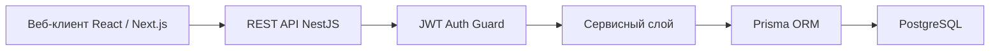
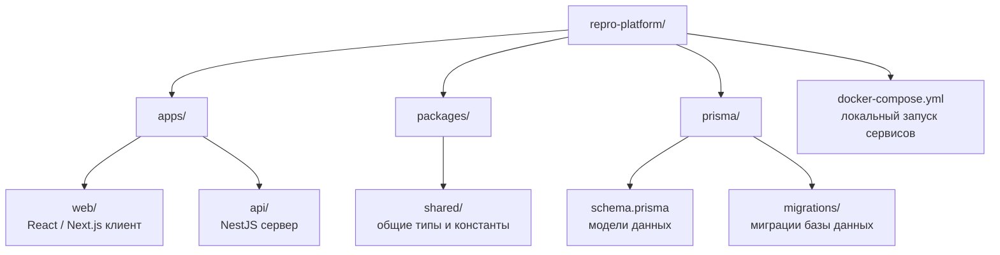
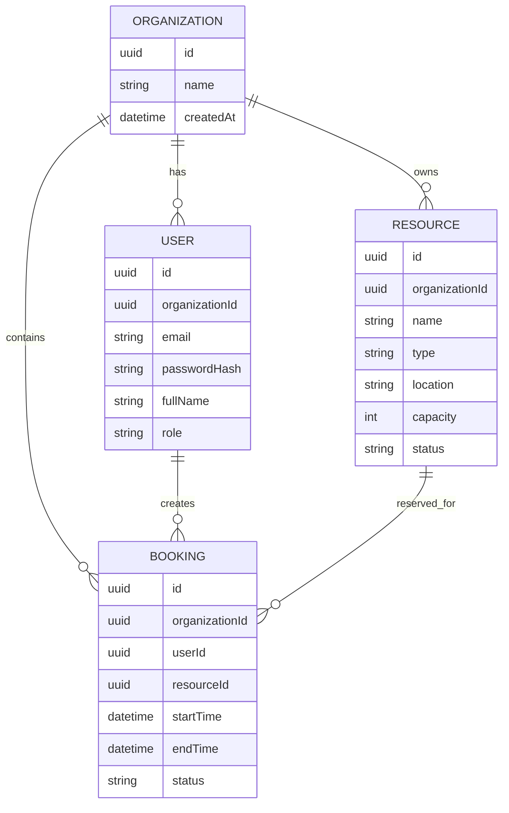
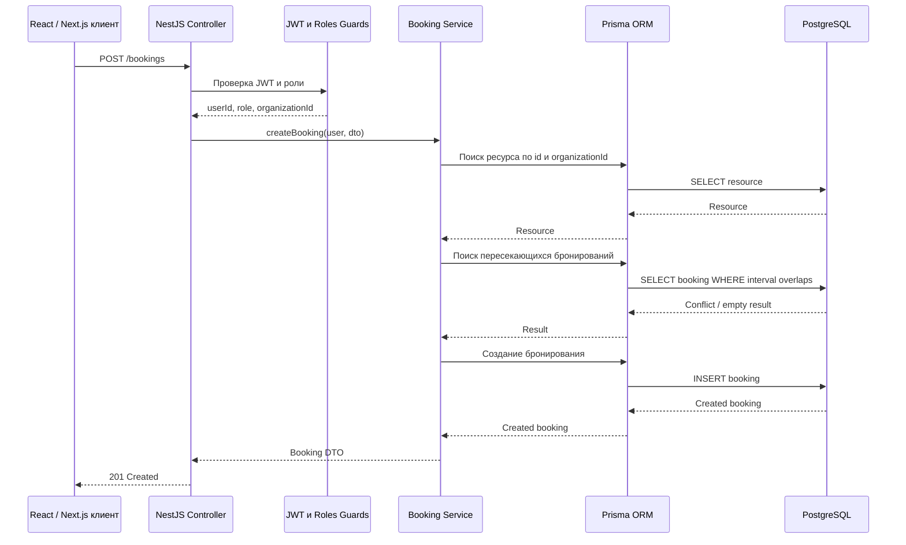
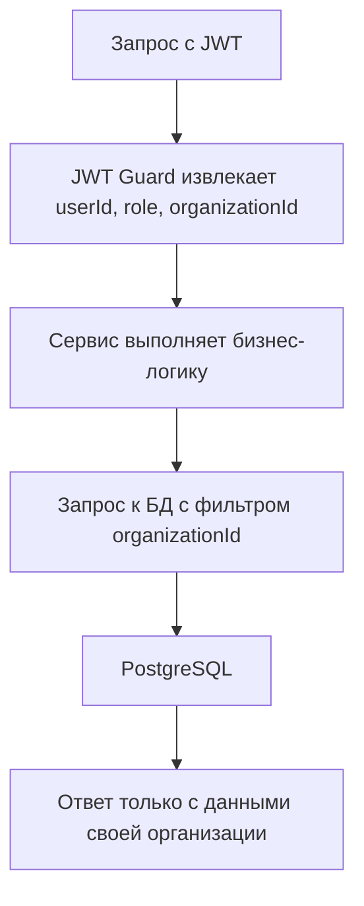
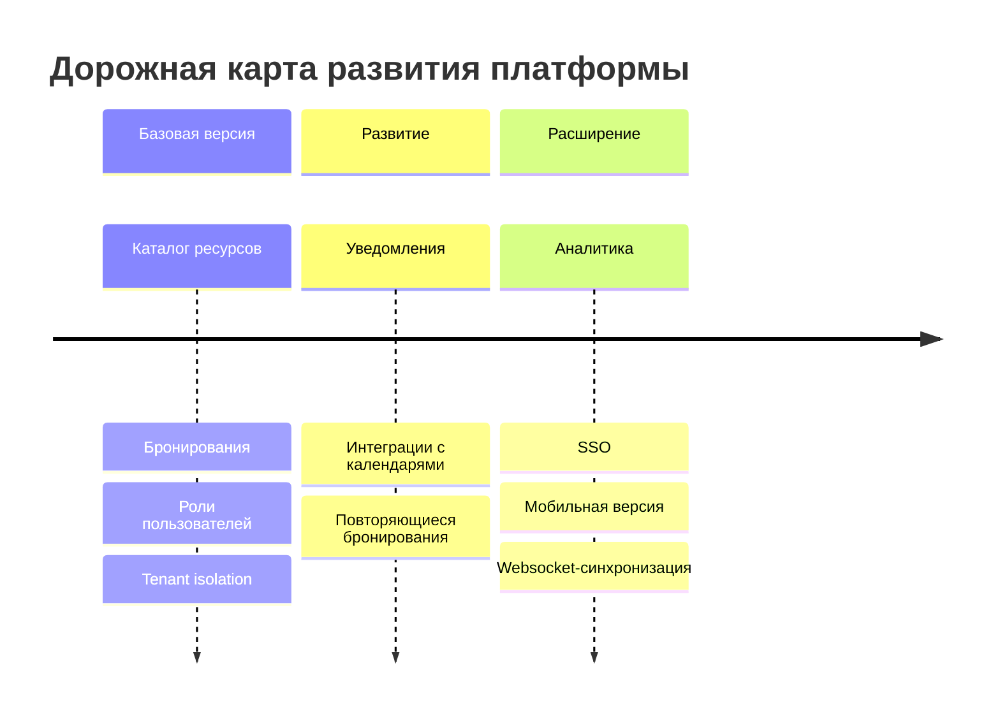
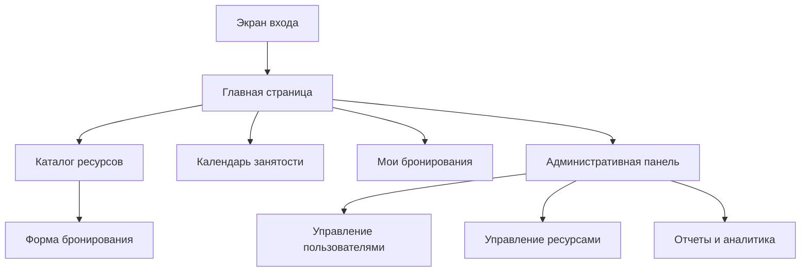

# Глава 3. Разработка, тестирование и оценка SaaS-платформы

## 3.1. Обоснование выбора технологий и структуры проекта

На основе анализа предметной области и проектных решений, сформулированных во второй главе, была разработана SaaS-платформа для управления и бронирования внутренних ресурсов компаний. Цель разработки заключается в создании веб-приложения, позволяющего организациям вести каталог внутренних ресурсов, управлять пользователями, создавать бронирования и предотвращать конфликты временных интервалов.

В проекте использована клиент-серверная архитектура. Пользователи работают с системой через веб-интерфейс, серверная часть обрабатывает бизнес-логику и запросы к базе данных, а PostgreSQL хранит данные организаций, пользователей, ресурсов и бронирований. Такой подход соответствует SaaS-модели: одна кодовая база обслуживает несколько организаций, а разделение данных выполняется за счет tenant-контекста.

Для реализации выбран следующий стек технологий.


Выбранный стек технологий и назначение компонентов приведены в [таблице 3.1](#table-3-1).

<a id="table-3-1"></a>
Таблица 3.1 — Стек технологий разработки SaaS-платформы и назначение компонентов.

| Компонент | Использованная технология | Назначение |
|---|---|---|
| Клиентская часть | React, TypeScript, Next.js | Интерфейс пользователя, формы, таблицы, календарные представления |
| Серверная часть | Node.js, NestJS, TypeScript | REST API, бизнес-логика, проверка прав доступа |
| База данных | PostgreSQL | Хранение организаций, пользователей, ресурсов и бронирований |
| ORM | Prisma | Описание моделей данных, миграции и типизированный доступ к БД |
| Аутентификация | JWT | Передача идентификатора пользователя, роли и организации между клиентом и API |
| Валидация данных | DTO и class-validator | Проверка входных параметров на уровне API |
| Развертывание | Docker, Docker Compose | Запуск клиентской части, API и базы данных в воспроизводимой среде |

React и Next.js выбраны для клиентской части, поскольку позволяют реализовать интерактивный интерфейс с разделением страниц по ролям пользователя. TypeScript используется на клиенте и сервере для снижения числа ошибок, связанных с типами данных. NestJS выбран для серверной части из-за модульной структуры, поддержки dependency injection, guards, middleware и удобной организации REST API. PostgreSQL применен как реляционная СУБД, так как предметная область содержит устойчивые связи между организациями, пользователями, ресурсами и бронированиями.

На этапе выбора архитектуры multi-tenancy рассматривались два варианта: отдельная база данных для каждой организации и общая база данных с разделением записей по `organizationId`. Первый вариант обеспечивает более жесткую физическую изоляцию, но усложняет миграции, резервное копирование и сопровождение. Для учебного проекта был выбран подход shared database, shared schema, поскольку он проще в эксплуатации и при этом позволяет продемонстрировать ключевые принципы SaaS-архитектуры: единую кодовую базу, tenant-контекст и логическую изоляцию данных.

Архитектура реализованного решения представлена на [рисунке 3.1](#fig-3-1).

<a id="fig-3-1"></a>
Рисунок 3.1 — Архитектура реализованной SaaS-платформы.



Проект разделен на клиентскую и серверную части. На сервере выделены модули `auth`, `organizations`, `users`, `resources`, `bookings` и `admin`. Каждый модуль содержит контроллеры, сервисы, DTO и проверки доступа. Такое разделение упрощает сопровождение кода и позволяет развивать отдельные части системы без нарушения общей архитектуры.


Структура каталогов проекта показана на [рисунке 3.2](#fig-3-2).

<a id="fig-3-2"></a>
Рисунок 3.2 — Структура каталогов проекта (монорепозиторий).



Связь выбранных технологий с требованиями из второй главы проявляется в том, что серверная часть обеспечивает проверку бизнес-правил, база данных — целостность информации, а веб-интерфейс — доступность системы для сотрудников без установки дополнительных программ. Использование Docker делает запуск решения воспроизводимым, а модульная структура NestJS поддерживает дальнейшее расширение платформы.

## 3.2. Реализация ключевых функциональных модулей

Модуль аутентификации и авторизации реализует вход пользователя, проверку учетных данных и выдачу JWT-токена. После успешного входа токен содержит идентификатор пользователя, его роль и идентификатор организации. Эти данные используются серверной частью при каждом запросе для проверки tenant-контекста и прав доступа.

Модуль организаций реализует SaaS-модель. Каждая компания представлена отдельной записью в таблице `Organization`. Пользователи, ресурсы и бронирования связаны с организацией через поле `organizationId`. Благодаря этому одна инсталляция платформы обслуживает несколько компаний, сохраняя логическую изоляцию их данных.

Модуль пользователей отвечает за учетные записи сотрудников. Для пользователя хранятся имя, электронная почта, хеш пароля, роль и организация. Обычный сотрудник может просматривать каталог и управлять своими бронированиями, администратор организации получает доступ к управлению ресурсами и пользователями своей компании.

Модуль ресурсов реализует каталог объектов, доступных для бронирования. Администратор организации добавляет ресурс, задает тип, местоположение, вместимость и статус. Если ресурс временно недоступен, его статус меняется на `inactive`, после чего система отклоняет новые бронирования для этого объекта.

Модуль бронирований является центральной частью платформы. Он обрабатывает создание, изменение, отмену и просмотр бронирований. При создании заявки система проверяет корректность временного интервала, существование ресурса, принадлежность ресурса организации пользователя, статус ресурса, права пользователя и наличие пересекающихся бронирований.


Связь реализованных модулей с функциональными требованиями представлена в [таблице 3.2](#table-3-2).

<a id="table-3-2"></a>
Таблица 3.2 — Связь реализованных модулей с функциональными требованиями второй главы.

| Модуль | Реализованные функции | Связанные требования |
|---|---|---|
| Аутентификация | Вход, выдача JWT, проверка пользователя | FR-01, NFR-05 |
| Организации | Хранение tenant-контекста, привязка данных к компании | FR-02, NFR-01 |
| Пользователи | Управление сотрудниками и ролями | FR-03, FR-09 |
| Ресурсы | Создание, редактирование, статусы и типы ресурсов | FR-04, FR-05 |
| Бронирования | Создание, отмена, история, проверка конфликтов | FR-06, FR-07, FR-08 |
| Администрирование | Управление ресурсами и пользователями организации | FR-03, FR-04, FR-09 |

Основные сущности предметной области реализованы в базе данных следующим образом.


ER-диаграмма реализованной базы данных представлена на [рисунке 3.3](#fig-3-3).

<a id="fig-3-3"></a>
Рисунок 3.3 — ER-диаграмма реализованной базы данных.



Фрагмент Prisma-схемы показывает, как в модели данных закреплена связь бронирования с организацией, пользователем и ресурсом.

```prisma
model Booking {
  id             String   @id @default(uuid())
  organizationId String
  userId         String
  resourceId     String
  startTime      DateTime
  endTime        DateTime
  status         BookingStatus @default(ACTIVE)
  createdAt      DateTime @default(now())

  organization Organization @relation(fields: [organizationId], references: [id])
  user         User         @relation(fields: [userId], references: [id])
  resource     Resource     @relation(fields: [resourceId], references: [id])

  @@index([organizationId])
  @@index([resourceId, startTime, endTime])
}
```

REST API реализовано вокруг основных пользовательских сценариев. В [таблице 3.3](#table-3-3) приведены ключевые endpoint'ы.

<a id="table-3-3"></a>
Таблица 3.3 — Основные маршруты REST API платформы.

| Метод и путь | Назначение | Ограничение доступа |
|---|---|---|
| `POST /auth/login` | Авторизация пользователя | Доступен без токена |
| `GET /resources` | Получение ресурсов своей организации | Авторизованный пользователь |
| `POST /resources` | Создание ресурса | Администратор организации |
| `PATCH /resources/:id` | Редактирование ресурса | Администратор организации |
| `GET /bookings` | Получение бронирований своей организации | Авторизованный пользователь |
| `POST /bookings` | Создание бронирования | Авторизованный пользователь |
| `PATCH /bookings/:id/cancel` | Отмена бронирования | Автор или администратор организации |
| `GET /admin/users` | Список пользователей организации | Администратор организации |

Проверка конфликтов бронирований реализована как отдельная бизнес-операция в сервисном слое. Новое бронирование создается только в том случае, если выбранный ресурс свободен в указанном временном интервале. Пересечение определяется условием:

```text
new_start < existing_end AND new_end > existing_start
```

Псевдокод алгоритма представлен ниже.

```text
function createBooking(user, resourceId, startTime, endTime):
    check user is authenticated
    check endTime > startTime
    resource = find resource by id and user.organizationId
    check resource exists and resource.status is active
    check user has permission to book resource

    conflicts = find bookings where:
        booking.organizationId = user.organizationId
        booking.resourceId = resourceId
        booking.status = active
        startTime < booking.endTime
        endTime > booking.startTime

    if conflicts is not empty:
        return error "Resource is unavailable"

    save booking with user.organizationId
    return created booking
```

В сервисе бронирования это условие применяется на уровне запроса к базе данных.

```typescript
const conflict = await prisma.booking.findFirst({
  where: {
    organizationId: user.organizationId,
    resourceId: dto.resourceId,
    status: 'ACTIVE',
    startTime: { lt: dto.endTime },
    endTime: { gt: dto.startTime },
  },
});

if (conflict) {
  throw new ConflictException('Resource is unavailable for selected time');
}
```

Алгоритм учитывает как полные совпадения интервалов, так и частичные пересечения. Например, бронирование с 10:30 до 11:30 конфликтует с существующим бронированием с 10:00 до 11:00. Бронирование с 11:00 до 12:00 не конфликтует, если предыдущее завершается ровно в 11:00, поскольку интервалы являются соседними, но не пересекаются.

Последовательность обработки запроса на создание бронирования показана на [рисунке 3.4](#fig-3-4). Эта схема отражает не только пользовательский сценарий, но и внутренние проверки, выполняемые серверной частью перед записью данных.

<a id="fig-3-4"></a>
Рисунок 3.4 — Последовательность создания бронирования.



## 3.3. Реализация multi-tenancy и ролевой модели

Для SaaS-платформы одной из ключевых задач является поддержка multi-tenancy. В разработанной системе используется модель shared database, shared schema: все организации работают с одной базой данных и одной схемой, а изоляция данных обеспечивается полем `organizationId` в ключевых таблицах.

Tenant-контекст определяется после авторизации пользователя. При каждом запросе JWT guard извлекает из токена `userId`, `role` и `organizationId`, после чего сервисный слой использует `organizationId` как обязательный фильтр при обращении к данным. Например, список ресурсов формируется только из записей, где `resource.organizationId` совпадает с `user.organizationId`.


Обработка tenant-контекста в запросах платформы показана на [рисунке 3.5](#fig-3-5).

<a id="fig-3-5"></a>
Рисунок 3.5 — Обработка tenant-контекста в запросах платформы.



Для снижения риска случайного доступа к чужим данным tenant-фильтр применяется в сервисах ресурсов, пользователей и бронирований. При изменении или удалении записи система проверяет не только идентификатор объекта, но и его принадлежность организации текущего пользователя.

```typescript
const resource = await prisma.resource.findFirst({
  where: {
    id: resourceId,
    organizationId: user.organizationId,
  },
});

if (!resource) {
  throw new NotFoundException('Resource not found');
}
```

Ролевая модель доступа реализована через RBAC. В системе используются четыре роли: сотрудник, администратор организации, руководитель и системный администратор. Каждая роль имеет свой набор прав.


Матрица разрешений по действиям и ролям приведена в [таблице 3.4](#table-3-4).

<a id="table-3-4"></a>
Таблица 3.4 — Матрица разрешений по действиям и ролям в реализованной системе.

| Действие | Сотрудник | Администратор организации | Руководитель | Системный администратор |
|---|---:|---:|---:|---:|
| Просмотр ресурсов своей организации | Да | Да | Да | Да |
| Создание собственного бронирования | Да | Да | Да | Нетипично |
| Отмена собственного бронирования | Да | Да | Да | Нетипично |
| Отмена чужого бронирования | Нет | Да | Нет | Только при поддержке |
| Создание и редактирование ресурсов | Нет | Да | Нет | Нетипично |
| Управление пользователями организации | Нет | Да | Нет | Нетипично |
| Просмотр отчетов | Нет | Да | Да | Да |
| Управление организациями | Нет | Нет | Нет | Да |

Проверка ролей выполняется на уровне guard'ов и декораторов контроллеров. Например, endpoint создания ресурса доступен только администратору организации.

```typescript
@UseGuards(JwtAuthGuard, RolesGuard)
@Roles('ORG_ADMIN')
@Post('/resources')
createResource(@CurrentUser() user: AuthUser, @Body() dto: CreateResourceDto) {
  return this.resourcesService.create(user, dto);
}
```

Безопасность платформы обеспечивается сочетанием двух проверок: роль определяет, может ли пользователь выполнить действие, а tenant-контекст определяет, к каким данным это действие применяется. Если обычный сотрудник пытается удалить ресурс, система отклоняет действие по роли. Если администратор организации пытается изменить ресурс другой организации, система отклоняет действие по tenant-фильтру.

## 3.4. Тестирование разработанной платформы

После реализации основных модулей было проведено тестирование, направленное на проверку корректности работы системы и соответствия требованиям. Основное внимание уделялось модулю бронирования, ролевой модели и изоляции данных организаций, поскольку ошибки в этих частях могут привести к конфликтам использования ресурсов или нарушению безопасности.

Тестирование выполнялось на локальном стенде Docker Compose. В состав стенда входили клиентское приложение, API-сервер и PostgreSQL. Для проверки API использовались автоматизированные интеграционные тесты и ручные запросы через HTTP-клиент. Пользовательские сценарии дополнительно проверялись через веб-интерфейс.


Конфигурация стенда и параметры тестирования представлены в [таблице 3.5](#table-3-5).

<a id="table-3-5"></a>
Таблица 3.5 — Конфигурация стенда и параметры выполнения тестирования.

| Параметр | Значение |
|---|---|
| Окружение | Docker Compose |
| База данных | PostgreSQL |
| Типы тестирования | Unit, integration, e2e, ручная проверка UI |
| Проверяемые роли | Сотрудник, администратор организации, руководитель |
| Тестовые организации | `Alpha LLC`, `Beta LLC` |
| Основные инструменты | Jest, Supertest, HTTP-клиент, браузер |

Функциональное тестирование проверяло вход пользователя, создание ресурса, просмотр каталога, создание бронирования, отмену заявки и изменение статуса ресурса. Тестирование ролей подтверждало, что пользователь имеет доступ только к разрешенным функциям. Тестирование изоляции данных проверяло SaaS-специфичное требование: пользователь одной организации не получает доступ к ресурсам, пользователям и бронированиям другой организации.


Результаты проверки ключевых сценариев приведены в [таблице 3.6](#table-3-6).

<a id="table-3-6"></a>
Таблица 3.6 — Результаты проверки ключевых сценариев и ограничений системы.

| № | Проверяемый сценарий | Входные данные | Ожидаемый результат | Фактический результат | Статус |
|---|---|---|---|---|---|
| 1 | Вход с корректными данными | Email и пароль пользователя | Пользователь получает JWT | JWT выдан, пользователь перенаправлен в систему | Пройден |
| 2 | Вход с неверным паролем | Email и неверный пароль | Ошибка авторизации | Возвращен статус `401` | Пройден |
| 3 | Создание ресурса администратором | Название, тип, локация | Ресурс появляется в каталоге | Запись создана в БД и отображена в UI | Пройден |
| 4 | Создание ресурса сотрудником | Роль `employee` | Доступ запрещен | Возвращен статус `403` | Пройден |
| 5 | Создание бронирования на свободное время | Свободный ресурс и интервал | Бронирование создается | Запись создана со статусом `ACTIVE` | Пройден |
| 6 | Полное совпадение интервала | 10:00-11:00 при существующем 10:00-11:00 | Заявка отклоняется | Возвращен статус `409` | Пройден |
| 7 | Частичное пересечение в начале | 09:30-10:30 при существующем 10:00-11:00 | Заявка отклоняется | Возвращен статус `409` | Пройден |
| 8 | Частичное пересечение в конце | 10:30-11:30 при существующем 10:00-11:00 | Заявка отклоняется | Возвращен статус `409` | Пройден |
| 9 | Соседний интервал | 11:00-12:00 при существующем 10:00-11:00 | Бронирование создается | Запись создана | Пройден |
| 10 | Попытка получить ресурс другой организации | Пользователь `Alpha LLC`, ресурс `Beta LLC` | Доступ запрещен или объект не найден | Возвращен статус `404` | Пройден |
| 11 | Отмена чужого бронирования сотрудником | Роль `employee` | Доступ запрещен | Возвращен статус `403` | Пройден |
| 12 | Отмена чужого бронирования администратором организации | Роль `org_admin` | Бронирование отменяется | Статус изменен на `CANCELLED` | Пройден |

Для проверки производительности был выполнен контрольный прогон основных API-запросов на тестовом наборе данных: 2 организации, 12 пользователей, 25 ресурсов и 200 бронирований. Перед измерением выполнялся предварительный прогрев приложения, после чего для каждой операции запускалась серия из 30 последовательных запросов через HTTP-клиент. В [таблице 3.7](#table-3-7) приведено среднее время ответа без учета времени ручного взаимодействия с интерфейсом.

<a id="table-3-7"></a>
Таблица 3.7 — Среднее время ответа API на тестовом наборе данных.

| Операция | Среднее время ответа | Результат |
|---|---:|---|
| Авторизация пользователя | 95 мс | Соответствует требованиям |
| Получение каталога ресурсов | 70 мс | Соответствует требованиям |
| Создание бронирования без конфликта | 120 мс | Соответствует требованиям |
| Создание конфликтующего бронирования | 110 мс | Соответствует требованиям |
| Получение списка бронирований пользователя | 85 мс | Соответствует требованиям |

Результаты тестирования показывают, что система выполняет основные функции, необходимые для управления внутренними ресурсами: пользователи просматривают доступные объекты и создают бронирования, администраторы управляют ресурсами и пользователями, алгоритм проверки пересечений предотвращает конфликтные ситуации, а tenant-фильтрация не допускает доступа к данным другой организации.

## 3.5. Оценка практической применимости, рисков и направлений развития

Разработанная SaaS-платформа применима в компаниях, где существует необходимость централизованного управления внутренними ресурсами. Наиболее очевидными пользователями являются офисные компании, IT-команды, образовательные организации, коворкинги и предприятия с распределенной инфраструктурой.

Практическая применимость платформы выражается в снижении количества конфликтов бронирования, уменьшении административной нагрузки и повышении прозрачности использования ресурсов. Сотрудники получают единый инструмент для поиска и бронирования, а администраторы — механизм контроля ресурсов и пользователей внутри своей организации.


Ожидаемые эффекты внедрения платформы систематизированы в [таблице 3.8](#table-3-8).

<a id="table-3-8"></a>
Таблица 3.8 — Ожидаемые эффекты внедрения платформы и способы их достижения.

| Ожидаемый эффект | Описание | Как достигается |
|---|---|---|
| Снижение конфликтов | Уменьшается число двойных бронирований | Автоматическая проверка интервалов |
| Экономия времени | Сотрудник сам видит доступность ресурса | Каталог, фильтры и список бронирований |
| Прозрачность | Руководство видит использование объектов | История бронирований и отчеты |
| Управляемость | Администратор контролирует ресурсы | Роли и административный модуль |
| Масштабируемость | Подключаются новые организации | SaaS-архитектура и tenant isolation |

При внедрении системы необходимо учитывать риски. Основные риски связаны с безопасностью данных, ошибками настройки прав, зависимостью от интернет-доступа, сопротивлением пользователей новым процессам и недостатком интеграций с корпоративной инфраструктурой.


Основные риски внедрения и эксплуатации приведены в [таблице 3.9](#table-3-9).

<a id="table-3-9"></a>
Таблица 3.9 — Основные риски внедрения и эксплуатации платформы.

| Риск | Вероятность | Влияние | Меры снижения |
|---|---:|---:|---|
| Нарушение изоляции данных | Средняя | Высокое | Обязательная фильтрация по `organizationId`, тесты, code review |
| Ошибки в проверке конфликтов | Средняя | Высокое | Набор тест-кейсов для временных интервалов |
| Одновременное создание бронирований | Средняя | Высокое | Транзакции БД, уникальные ограничения, дальнейшая поддержка locking |
| Сложность внедрения у пользователей | Средняя | Среднее | Простой интерфейс и инструкции |
| Недостаток интеграций | Высокая | Среднее | План развития интеграций с календарями и SSO |
| Недоступность сервиса | Низкая/средняя | Высокое | Резервное копирование, мониторинг, контейнеризация |

Текущая версия имеет ограничения. В ней реализованы базовые процессы бронирования, но не реализованы распределенные блокировки для горизонтально масштабируемого развертывания, optimistic concurrency для сложных конкурентных сценариев, websocket-синхронизация календаря в реальном времени, повторяющиеся бронирования и интеграции с внешними календарями. Эти ограничения не препятствуют работе базовой версии, но определяют направления дальнейшего развития.

Дальнейшее развитие платформы включает интеграцию с Google Calendar и Outlook, поддержку SSO, уведомления по электронной почте и в мессенджерах, расширенную аналитику, мобильную версию, QR-коды для подтверждения использования ресурса и механизм повторяющихся бронирований.


Дорожная карта развития платформы представлена на [рисунке 3.6](#fig-3-6).

<a id="fig-3-6"></a>
Рисунок 3.6 — Дорожная карта развития платформы.



## 3.6. Описание реализованного интерфейса

Клиентская часть платформы реализует пользовательский путь от входа в систему до создания и просмотра бронирований. Интерфейс построен с учетом ролей: сотруднику отображаются каталог ресурсов, форма бронирования и раздел собственных заявок, а администратору организации дополнительно доступны управление ресурсами и пользователями.

На клиентской стороне логика создания бронирования вынесена в отдельную функцию, которая отправляет данные формы на API и обрабатывает типовые ошибки. Такой подход не привязывает форму к конкретному способу отображения ошибки: компонент отвечает за пользовательский интерфейс, а функция запроса — за взаимодействие с сервером.

```typescript
type CreateBookingInput = {
  resourceId: string;
  startTime: string;
  endTime: string;
};

export async function createBooking(input: CreateBookingInput, token: string) {
  const response = await fetch('/api/bookings', {
    method: 'POST',
    headers: {
      'Content-Type': 'application/json',
      Authorization: `Bearer ${token}`,
    },
    body: JSON.stringify(input),
  });

  if (response.status === 409) {
    throw new Error('Выбранный ресурс уже занят в указанное время');
  }

  if (!response.ok) {
    throw new Error('Не удалось создать бронирование');
  }

  return response.json();
}
```

Форма бронирования использует эту функцию после проверки обязательных полей. Если сервер возвращает `409 Conflict`, пользователь получает понятное сообщение о пересечении интервалов, а успешное создание заявки приводит к обновлению списка бронирований.

### 3.6.1. Экран авторизации

Экран авторизации является точкой входа в систему. Пользователь вводит электронную почту и пароль, после чего клиент отправляет запрос `POST /auth/login`. При успешной проверке сервер возвращает JWT, а пользователь перенаправляется в основной интерфейс платформы. При ошибке авторизации интерфейс отображает сообщение о неверных учетных данных. Внешний вид экрана показан на [рисунке 3.7](#fig-3-7).

<a id="fig-3-7"></a>
Место для вставки рисунка 3.7 — Экран входа в SaaS-платформу.

### 3.6.2. Главная страница и навигация

После входа пользователь попадает на главную страницу. На ней отображаются ближайшие бронирования, быстрые действия и навигационное меню. Состав меню зависит от роли: сотрудник видит каталог ресурсов и свои бронирования, администратор организации также видит административный раздел, а руководитель получает доступ к отчетам. Главная страница представлена на [рисунке 3.8](#fig-3-8).

<a id="fig-3-8"></a>
Место для вставки рисунка 3.8 — Главная страница пользователя.

### 3.6.3. Каталог ресурсов

Каталог ресурсов содержит список объектов, доступных в организации пользователя. Каждый ресурс отображается с названием, типом, расположением, вместимостью и статусом. Для поиска реализованы фильтры по типу ресурса, дате, времени, вместимости и локации. Ресурсы со статусом `inactive` отображаются как недоступные и не могут быть выбраны для нового бронирования. Интерфейс каталога показан на [рисунке 3.9](#fig-3-9).

<a id="fig-3-9"></a>
Место для вставки рисунка 3.9 — Каталог ресурсов организации.

### 3.6.4. Форма создания бронирования

Форма создания бронирования позволяет выбрать ресурс, дату, время начала и окончания использования. После отправки формы клиент вызывает `POST /bookings`, а сервер выполняет проверки корректности времени, принадлежности ресурса организации пользователя, статуса ресурса, прав пользователя и пересечений с существующими бронированиями. При успешном создании заявка появляется в разделе «Мои бронирования». Форма представлена на [рисунке 3.10](#fig-3-10).

<a id="fig-3-10"></a>
Место для вставки рисунка 3.10 — Форма создания бронирования.

### 3.6.5. Раздел «Мои бронирования»

Раздел «Мои бронирования» отображает активные, завершенные и отмененные заявки пользователя. Для удобства реализована фильтрация по статусу и дате. Пользователь может отменить будущую активную бронь, после чего интервал снова становится доступным для других сотрудников организации. Список бронирований показан на [рисунке 3.11](#fig-3-11).

<a id="fig-3-11"></a>
Место для вставки рисунка 3.11 — Список бронирований пользователя.

### 3.6.6. Административная панель

Административная панель доступна пользователям с ролью администратора организации. Через нее администратор добавляет ресурсы, редактирует их параметры, меняет статус доступности, просматривает бронирования сотрудников и управляет пользователями своей организации. Все административные операции выполняются только в пределах tenant-контекста текущего пользователя. Административная панель представлена на [рисунке 3.12](#fig-3-12).

<a id="fig-3-12"></a>
Место для вставки рисунка 3.12 — Административная панель управления ресурсами.


Соответствие экранов интерфейса функциональным требованиям приведено в [таблице 3.10](#table-3-10).

<a id="table-3-10"></a>
Таблица 3.10 — Соответствие экранов пользовательского интерфейса назначению и функциональным требованиям.

| Экран | Назначение | Кто использует | Подтверждаемое требование |
|---|---|---|---|
| Авторизация | Вход в систему | Все пользователи | FR-01 |
| Главная страница | Быстрый доступ к функциям | Все пользователи | FR-01, FR-09 |
| Каталог ресурсов | Поиск объектов | Сотрудники, администраторы | FR-04, FR-05 |
| Форма бронирования | Создание заявки | Сотрудники | FR-06, FR-07 |
| Мои бронирования | Контроль заявок | Сотрудники | FR-08 |
| Административная панель | Управление ресурсами и пользователями | Администраторы | FR-03, FR-04, FR-09 |

## 3.7. Сценарии демонстрации работы системы

Для демонстрации разработанной платформы подготовлены сценарии, которые показывают выполнение ключевых требований и работу основных модулей.

Первый сценарий — создание ресурса администратором. Администратор входит в систему, открывает административную панель, нажимает кнопку добавления ресурса, заполняет название, тип, расположение и вместимость. После сохранения ресурс появляется в каталоге организации и становится доступен для бронирования.

Второй сценарий — бронирование свободного ресурса сотрудником. Сотрудник открывает каталог, выбирает нужный ресурс, указывает дату и время, отправляет форму. Система проверяет доступность и создает бронирование. После этого запись отображается в разделе «Мои бронирования».

Третий сценарий — попытка создать конфликтующее бронирование. Другой пользователь выбирает тот же ресурс и пересекающийся временной интервал. Система выполняет проверку, обнаруживает пересечение и возвращает сообщение о недоступности ресурса. Этот сценарий демонстрирует центральную бизнес-логику проекта.

Четвертый сценарий — проверка изоляции данных организаций. Пользователь одной организации входит в систему и видит только свои ресурсы и бронирования. Ресурсы другой организации ему недоступны как в интерфейсе, так и при прямом обращении к API.


Сценарии демонстрации платформы систематизированы в [таблице 3.11](#table-3-11).

<a id="table-3-11"></a>
Таблица 3.11 — Сценарии демонстрации платформы.

| Сценарий | Цель демонстрации | Результат |
|---|---|---|
| Создание ресурса | Работа административного модуля | Ресурс создан и отображен в каталоге |
| Успешное бронирование | Основной пользовательский сценарий | Заявка создана и появилась в расписании |
| Конфликт бронирования | Проверка бизнес-логики | Система вернула ошибку `409 Conflict` |
| Отмена бронирования | Управление заявками | Статус изменен на `CANCELLED` |
| Изоляция организаций | SaaS-специфика | Пользователь видит только данные своей организации |
| Ролевая модель | Безопасность доступа | Сотрудник не получает доступ к административным функциям |

## 3.8. Связь реализованного функционала с требованиями

Реализованные функции соответствуют требованиям, сформулированным во второй главе. [Таблица 3.12](#table-3-12) систематизирует, каким модулем и артефактом подтверждается выполнение каждого функционального требования.

<a id="table-3-12"></a>
Таблица 3.12 — Соответствие реализованного функционала требованиям второй главы.

| Требование | Реализованный функционал | Подтверждение |
|---|---|---|
| FR-01 Авторизация | Экран входа, `POST /auth/login`, JWT | Тесты авторизации, [рисунок 3.7](#fig-3-7) |
| FR-02 Организации | Хранение `organizationId`, tenant-фильтры | ER-диаграмма, тест изоляции данных |
| FR-03 Пользователи | Управление пользователями организации | Административная панель, RBAC |
| FR-04 Ресурсы | CRUD ресурсов | API ресурсов, [рисунок 3.9](#fig-3-9) |
| FR-05 Доступность | Статусы ресурсов и просмотр занятости | Каталог ресурсов, фильтры |
| FR-06 Бронирование | Создание заявки через `POST /bookings` | Сценарий успешного бронирования |
| FR-07 Конфликты | Проверка пересечений интервалов | Алгоритм и тест-кейсы 6-9 |
| FR-08 История | Список бронирований пользователя | Раздел «Мои бронирования» |
| FR-09 Роли | Guards, RBAC, ограничение действий | [Таблица 3.4](#table-3-4), тесты доступа |

Дополнительно были выполнены нефункциональные требования. Безопасность обеспечивается JWT, RBAC и tenant-фильтрацией. Масштабируемость поддерживается разделением клиентской и серверной частей, контейнеризацией и использованием PostgreSQL. Удобство эксплуатации повышается за счет Docker Compose, который позволяет запускать приложение и базу данных одной командой.

## 3.9. Экранная карта приложения

Экранная карта показывает, какие страницы входят в систему, как они связаны между собой и какие роли имеют к ним доступ. Карта начинается со страницы авторизации. После успешного входа пользователь попадает на главную страницу. Оттуда он переходит в каталог ресурсов, календарь, раздел собственных бронирований или административные разделы, если его роль это позволяет.


Экранная карта SaaS-платформы представлена на [рисунке 3.13](#fig-3-13).

<a id="fig-3-13"></a>
Рисунок 3.13 — Экранная карта SaaS-платформы.




Легенда к экранной карте приведена в [таблице 3.13](#table-3-13).

<a id="table-3-13"></a>
Таблица 3.13 — Легенда к экранной карте: экраны, роли и назначение.

| Экран | Основная роль | Назначение |
|---|---|---|
| Вход | Все пользователи | Авторизация в системе |
| Главная | Все пользователи | Быстрый доступ к основным функциям |
| Каталог ресурсов | Сотрудник | Поиск доступного объекта |
| Календарь | Сотрудник, администратор | Просмотр занятости |
| Форма бронирования | Сотрудник | Создание заявки |
| Мои бронирования | Сотрудник | Контроль собственных заявок |
| Управление ресурсами | Администратор | Добавление и редактирование ресурсов |
| Управление пользователями | Администратор | Работа с сотрудниками |
| Отчеты | Руководитель | Анализ загрузки |

Экранная карта подтверждает, что разработка охватывает не отдельную функцию, а целостный пользовательский путь: вход в систему, поиск ресурса, создание бронирования, контроль заявок и административное управление.

## Выводы по главе 3

В третьей главе была описана разработка SaaS-платформы для управления и бронирования внутренних ресурсов компаний. Были обоснованы выбранные технологии: React, Next.js и TypeScript для клиентской части, NestJS для серверной части, PostgreSQL и Prisma для хранения и обработки данных, JWT для аутентификации и Docker для развертывания.

Особое внимание было уделено реализации multi-tenancy и ролевой модели доступа. Изоляция данных организаций обеспечивается полем `organizationId`, обязательной фильтрацией запросов и проверками в сервисном слое. Ролевая модель реализована через RBAC и ограничивает доступ к административным операциям.

Также была описана бизнес-логика проверки пересечений временных интервалов, которая является центральной для корректной работы системы бронирования. Проверка основана на условии `new_start < existing_end AND new_end > existing_start` и применяется при создании каждой заявки.

Проведенное тестирование подтвердило корректность основных сценариев: авторизации, управления ресурсами, создания бронирований, проверки конфликтов, разграничения прав и изоляции данных организаций. Оценка практической применимости показала, что платформа может использоваться компаниями для повышения прозрачности использования ресурсов, снижения административной нагрузки и уменьшения числа конфликтов бронирования.

Дальнейшее развитие системы связано с интеграцией с корпоративными календарями, внедрением SSO, добавлением уведомлений, аналитики, мобильной версии, повторяющихся бронирований и синхронизации в реальном времени. Таким образом, разработанная платформа решает базовые задачи предметной области и создает основу для последующего расширения функциональности.
